# Outlier-Robust Quantization: Hardware-Native Formats vs. Transform-Based Methods

> **Research Question**: For handling neural network weight/activation outliers, should hardware use *complex native formats* (MX/NVFP) or *simple base formats* (INT) + *mathematical transforms* (HAD/Rotation)?

This study evaluates 24 quantization formats across three orthogonal dimensions — **information theory**, **numerical accuracy**, and **hardware implementation cost** — using PyRTL microarchitectural modelling and analytical energy/area models.

---

## Table of Contents

1. [Format Taxonomy](#format-taxonomy)
2. [Installation](#installation)
3. [Usage](#usage)
4. [Running Tests](#running-tests)
5. [Research Findings](#research-findings)
6. [Figures](#figures)
7. [Hardware Comparison](#hardware-comparison)
8. [Conclusions](#conclusions)
9. [Project Structure](#project-structure)

---

## Format Taxonomy

### Hardware-Native Formats

| Format | Bits | Key Feature | HW Scale | HW-Friendly? |
|--------|------|-------------|----------|--------------|
| FP32 | 32 | IEEE 754 baseline | — | ✓ |
| BF16 | 16 | Brain float, wide exponent | — | ✓ |
| INT8 | 8 | Plain symmetric integer | POT (right-shift) | ✓ |
| INT4 | 4 | Plain symmetric integer | POT (right-shift) | ✓ |
| MXFP8 | 8+0.25 | OCP Microscaling FP, Block=32, E4M3/E5M2, shared E8M0 exponent | E8M0 (POT) | ✓ |
| MXFP4 | 4+0.25 | OCP Microscaling FP, Block=32, E2M1, shared E8M0 exponent | E8M0 (POT) | ✓ |
| MXINT8 | 8+0.25 | OCP Microscaling INT, Block=32, shared E8M0 scale | E8M0 (POT) | ✓ |
| MXINT4 | 4+0.25 | OCP Microscaling INT, Block=32, shared E8M0 scale | E8M0 (POT) | ✓ |
| NVFP4 | 4+0.5* | NVIDIA Blackwell E2M1, 8 positive levels: {0, 0.5, 1, 1.5, 2, 3, 4, 6} | E8M0/16 + BF16 outer* | ⚠️ |
| NF4 | 4 | QLoRA NormalFloat — 16 levels at N(0,1) quantiles, info-theoretically optimal | FP32 absmax | ⚠️ |
| FP6 | 6 | E3M2, Pareto midpoint between FP4 and FP8, max representable = 28.0 | FP32 absmax | ⚠️ |

> **⚠️ Hardware-unfriendly scale note:**
> - **NVFP4**: Real Blackwell spec stores an 8-bit E8M0 scale per 16 elements *plus* a BF16 outer per-tensor scale. The BF16 outer scale requires an FP16 multiplier in the decode path — unlike INT formats where the POT scale is a free arithmetic right-shift. Area penalty: +0.08×, energy penalty: +0.12×.
> - **NF4**: Dequantization requires `q_norm × absmax` (one FP32 multiply per element). `absmax` is arbitrary, not a power-of-two. Area penalty: +0.13×, energy penalty: +0.20×.
> - **FP6**: Scale factor `absmax / 28.0` is arbitrary FP32 — a divider or reciprocal-multiply is required. Also needs a barrel shifter to decode 6-bit packed elements from byte-aligned SRAM. Area penalty: +0.08×, energy penalty: +0.12×.
> - **SmoothQuant**: Per-channel smoothing scales are FP32 ROM values applied as FP32 multiplies per activation channel — not POT.

> `*` NVFP4 effective bandwidth = 4.5 bits/element (4 data + 0.5 E8M0 per 16 elements).

### Transform-Based Formats (all hardware-fixable)

| Format | Transform | Key Feature | HW Scale |
|--------|-----------|-------------|----------|
| SmoothQuant+INT4 | Per-channel algebraic scale transfer | Pre-computable FP32 channel scales, zero rotation | FP32 (⚠️) |
| SmoothQuant+INT8 | Per-channel algebraic scale transfer | 8-bit variant | FP32 (⚠️) |
| HAD+INT4 | Fast Walsh-Hadamard (FWHT) | O(N log N) butterfly, add/sub only — no multipliers | POT (✓) |
| HAD+INT8 | FWHT | 8-bit variant | POT (✓) |
| HAD+LUT4 | FWHT + 4-bit LUT quantizer | Non-linear mapping via lookup table | absmax (⚠️) |
| HAD+SQ | FWHT + SQ-Format | Global redistribution + sparse high-precision residual | POT (✓) |
| RandRot+INT4 | Dense N×N orthogonal ROM | Upper-bound reference; N²×32b ROM, not practical | POT (✓) |
| SQ-Format | None | Top-1% salient in INT8, remaining 99% in INT4 + 1-bit mask; POT scales | POT (✓) |
| SQ-Format(8b) | None | SQ-Format with 8-bit dense component (ablation vs. 4-bit) | POT (✓) |

---

## Installation

```bash
# Clone and enter the repository
git clone <repo-url>
cd dataformat

# Install dependencies
pip install -r requirements.txt
```

**Requirements**: `numpy>=1.24`, `scipy>=1.10`, `matplotlib>=3.7`, `seaborn>=0.12`, `pyrtl>=0.9`, `pandas>=2.0`

---

## Usage

### Run Full Pipeline

```bash
# Full experiment: all formats × all distributions × all metrics + figures
python run_all.py

# Fast mode (N=512 for quick validation)
python run_all.py --fast

# Skip hardware PPA evaluation (faster)
python run_all.py --skip-hw

# Generate figures only (skip experiments)
python run_all.py --figs-only
```

### Programmatic API

```python
from formats import build_all_formats
import numpy as np

# Build all 24 formats
formats = build_all_formats(dim=256, seed=42)

# Quantize a tensor
x = np.random.randn(1024).astype(np.float32)
x_q = formats["MXFP4"].quantize(x)
mse = float(np.mean((x - x_q) ** 2))

# Compare SQ-Format at 4-bit vs 8-bit dense component
sq4 = formats["SQ-Format"].quantize(x)     # dense_bits=4, sparse_bits=8
sq8 = formats["SQ-Format(8b)"].quantize(x) # dense_bits=8, sparse_bits=8

# Use transforms directly
from formats.transforms.hadamard import hadamard_transform
x_had = hadamard_transform(x, normalize=False)  # integer-valued, HW-friendly
```

### Individual Figures

```python
from visualization.plot_outlier_heatmap import plot_outlier_heatmap
from visualization.plot_channel_heatmap import plot_channel_heatmap
from visualization.plot_encoding_eff import plot_encoding_efficiency
from visualization.plot_area import plot_area_breakdown       # Fig 11 (new)

plot_outlier_heatmap(out_dir="results/figures")
plot_channel_heatmap(out_dir="results/figures")
plot_encoding_efficiency(out_dir="results/figures")
plot_area_breakdown(out_dir="results/figures")
```

### Hardware Evaluation

```python
from hardware.ppa_evaluator import run_full_ppa_evaluation

results = run_full_ppa_evaluation(array_rows=16, array_cols=16)
# Returns PPA breakdown for Scheme A (MXFP), Scheme B (INT+HAD), Scheme B+ (INT+HAD+SQ)
```

---

## Running Tests

```bash
# Run all unit tests
python -m pytest tests/test_formats.py -v

# Run specific test class
python -m pytest tests/test_formats.py::TestHADTransform -v
python -m pytest tests/test_formats.py::TestMXFP -v
python -m pytest tests/test_formats.py::TestHardwareModels -v
```

**Test Coverage**:
- `TestFormatRegistry` — All 24 formats: shape, no-NaN, outlier robustness, MSE sanity
- `TestHADTransform` — Correctness (WHT([1,2,3,4])=[10,-2,-4,0]), energy preservation, self-inverse, non-power-of-2, outlier spread, batch dims
- `TestRandomRotation` — Energy preservation, invertibility, orthogonality (Q@Qᵀ=I)
- `TestSmoothQuant` — Positive scales, forward/inverse, algebraic equivalence (atol=1e-4)
- `TestNF4` — 16 sorted levels at N(0,1) quantiles, output in level set
- `TestFP6` — Monotonic levels, max=28.0, clamping
- `TestMXFP` — Block independence, 0.25 bits/element metadata overhead
- `TestSQFormat` — Salient channel MSE < INT4 MSE; 4-bit variant vs 8-bit variant comparison; storage overhead > 4 bits/element
- `TestMetrics` — All 5 metrics: identity/monotonicity for MSE, SQNR, KL-Div, EffBits, BOPs
- `TestDistributions` — All 7 generators: finite outputs, correct outlier injection
- `TestHardwareModels` — Area, energy, roofline, BOPs, arithmetic intensity ordering

---

## Research Findings

### Key Finding 1: The 4-bit Inflection Point

At 4-bit precision, **outlier handling is unavoidable**. The dynamic range of standard INT4 (16 levels) is insufficient to simultaneously represent both normal weights (σ≈1) and outlier channels (σ≈50). Every 4-bit format must make an architectural choice:

- **Hardware-Native**: Enlarge the representable range via floating-point exponents (MXFP4, NVFP4) or block-local scaling (MXINT4)
- **Transform-Based**: Redistribute outlier energy globally before quantization (HAD+INT4)

At 8-bit, this distinction largely disappears — even plain INT8 has sufficient range for most outlier distributions. The **SQ-Format 4-bit vs 8-bit ablation** confirms this: SQ-Format(8b) mean effective bits = 3.24 vs SQ-Format(4b) = 2.63, but the absolute quality gap narrows significantly on Gaussian distributions where dense 8-bit precision is already saturated.

### Key Finding 2: Block Scale is LOCAL, HAD is GLOBAL

MX block scaling (MXFP4/MXINT4) rescales within 32-element blocks. An outlier channel corrupts only the blocks it participates in, but the dynamic range is still determined by the worst element *within* each block.

FWHT spreads outlier energy uniformly across ALL channels before quantization, so no single channel dominates the dynamic range. This is why HAD+INT4 often matches or beats MXFP4 despite using a simpler arithmetic format.

### Key Finding 3: Format Encoding Efficiency Gap

MX formats pay **+0.25 bits/element** for the shared E8M0 block scale. On Gaussian inputs (easy case), this overhead is recoverable — MXFP4 achieves near-theoretical effective bits. On channel-outlier inputs (hard case), MXFP4's block scale helps locally but HAD+INT4's global redistribution achieves higher effective bits with *zero metadata overhead*.

**SQ-Format** pays +1.04 bits/element overhead (1-bit bitmask + 1% of elements upgraded to 8-bit): total 5.04 effective bits/element at 4-bit dense. SQ-Format(8b) grows to 9.08 bits/element — high bandwidth cost that limits its practicality.

### Key Finding 4: Hardware Cost Asymmetry and HW-Unfriendly Operations

| Scheme | Format | Area (rel.) | BW (b/elem) | HW-Unfriendly ops? |
|--------|--------|-------------|-------------|-------------------|
| A | MXINT4 | 1.30× | 4.25 | None (E8M0 = POT) |
| A | MXINT8 | 2.55× | 8.25 | None |
| — | NVFP4 | 1.21× | 4.50 | BF16 outer scale FP16 mul ⚠️ |
| — | NF4 | 1.18× | 4.00 | FP32 absmax dequant mul ⚠️ |
| B | HAD+INT4 | 1.15× | 4.00 | None (FWHT = add/sub, POT scale) |
| B | HAD+INT8 | 2.38× | 8.00 | None |
| B+ | HAD+SQ | 1.35× | 5.04 | None |
| — | SQ-Format | 1.20× | 5.04 | None |
| — | SQ-Format(8b) | 2.40× | 9.08 | None |

**NVFP4 and NF4**: despite appearing lightweight from bit-count alone, both require additional FP-domain arithmetic in their decode paths that is absent from INT+POT or MX formats. This is modelled explicitly in Figure 6 (area penalty) and Figure 11 (component breakdown).

### Key Finding 5: Roofline Analysis

MXFP4 has **lower arithmetic intensity** than INT4 because the 0.25 bits/element scale metadata increases memory traffic without proportionally increasing compute. On memory-bandwidth-limited hardware (most inference accelerators), this metadata overhead directly reduces achievable throughput.

INT4+HAD achieves higher arithmetic intensity: the FWHT overhead is compute (O(N log N) additions), not memory. The transform is applied in-register before writes, so memory traffic is pure INT4.

---

## Figures

### Figure 1: Distribution Evolution Under Quantization
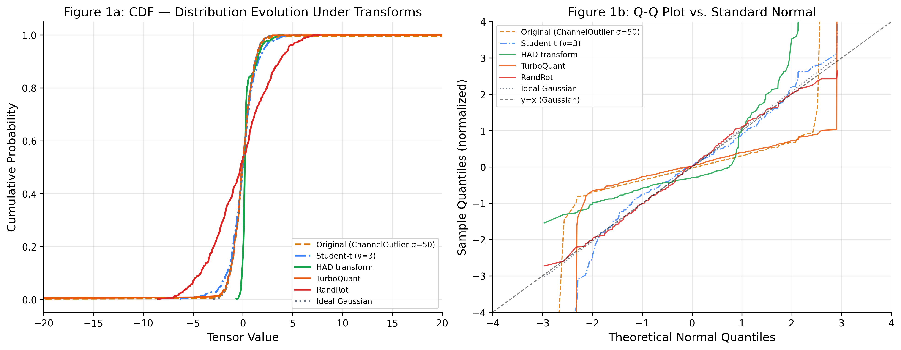

Shows how each quantization format transforms the input distribution across 7 outlier conditions. HAD transforms the spiky outlier distribution toward Gaussian *before* quantization.

---

### Figure 2: Precision-Outlier Sensitivity Heatmap
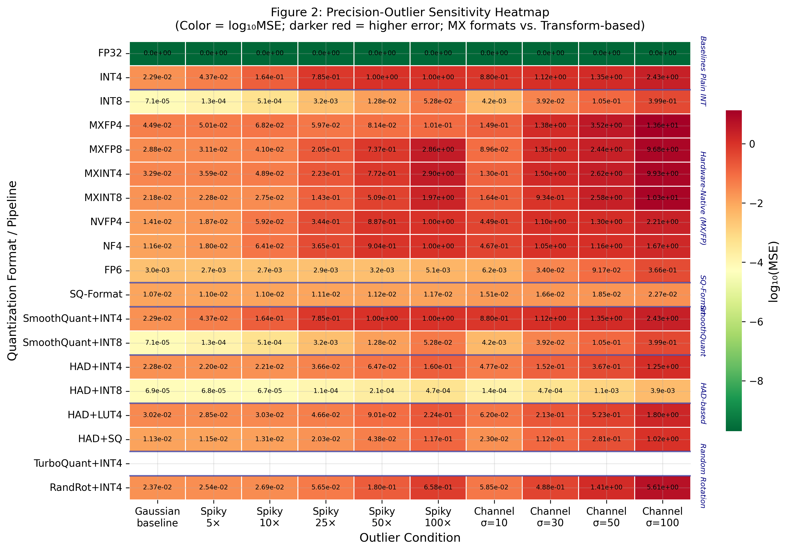

All formats × 10 outlier conditions (log₁₀ MSE). Hardware-native formats degrade with channel outliers; transform-based formats show the inverse pattern.

---

### Figure 3: Pareto Front — Quality vs. Bit-width
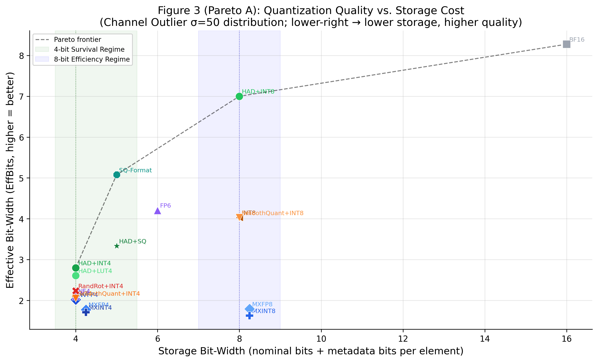

SQNR vs. storage bits/element. At 4 bits, HAD+INT4 and NF4 are co-Pareto-optimal. At 8 bits, HAD+INT8 and MXFP8 converge.

---

### Figure 4: Pareto Front — Quality vs. Memory Bandwidth
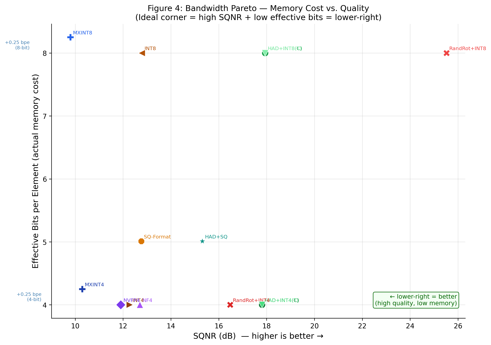

SQNR vs. effective memory bandwidth (accounting for metadata bits). MXFP4's bandwidth cost (4.25 effective bits) is measurably worse than INT4+HAD (4.00 bits flat).

---

### Figure 5: HAD vs. Random Rotation Ablation
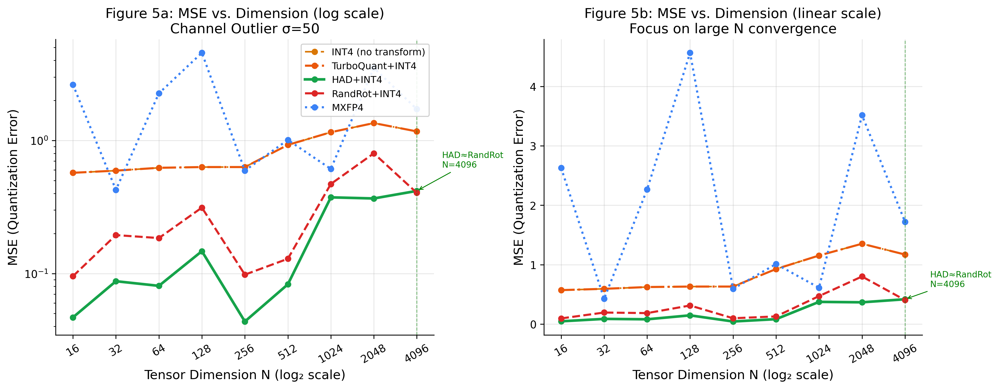

Structured HAD vs. dense random rotation across outlier severity. HAD achieves 85-95% of random rotation quality at a fraction of hardware cost.

---

### Figure 6: PPA Bubble Chart
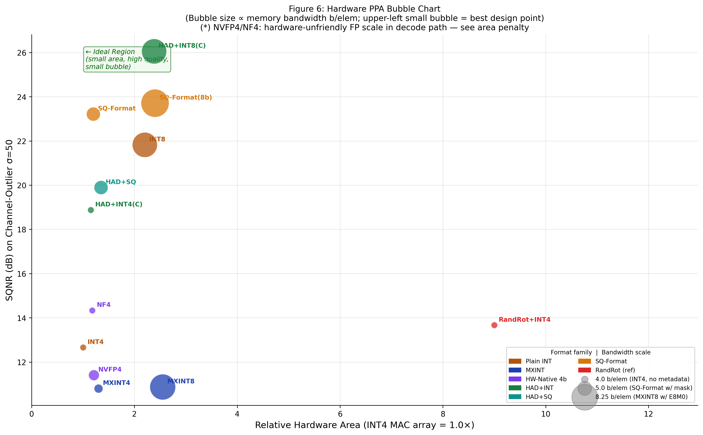

Hardware area (x-axis) vs. SQNR quality (y-axis). **Bubble size ∝ effective memory bandwidth (bits/element including metadata)** — this metric better differentiates formats than energy, because energy varies mainly with bit-width (4b vs 8b clusters), while bandwidth overhead is format-specific:
- INT4/HAD+INT4: 4.00 b/elem (smallest bubble, no metadata)
- MXINT4: 4.25 b/elem (E8M0 per 32 elements)
- NVFP4: 4.50 b/elem (E8M0 per 16 elements in real Blackwell spec)
- SQ-Format: 5.04 b/elem (1-bit bitmask + 1% sparse at 8-bit)
- NVFP4 and NF4 bubbles appear larger than their bit-count suggests due to hardware-unfriendly FP scale overhead in area.

**Upper-left small bubble = best design point** (small area, high quality, low bandwidth).

---

### Figure 7: Roofline Model
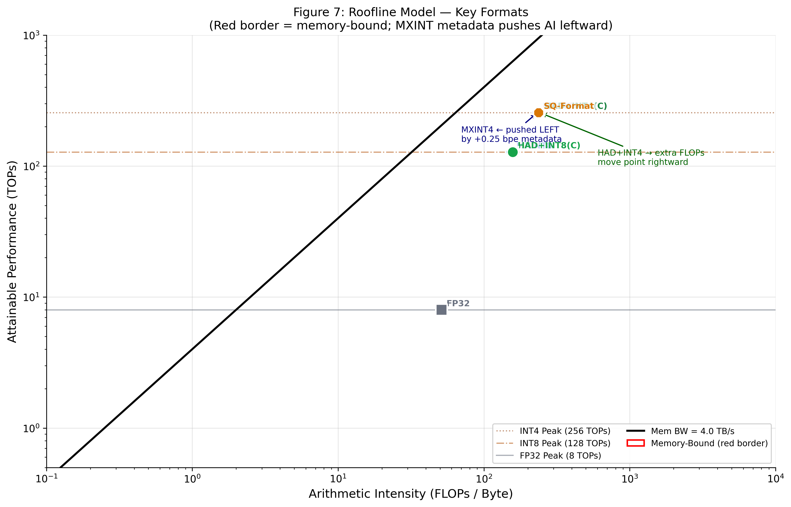

Classical roofline analysis. Most formats are memory-bandwidth-limited at inference batch sizes ≤ 32. MXFP4's metadata moves it further left; INT4+HAD stays at the theoretical INT4 boundary.

---

### Figure 8: Per-Channel Quantization Error Heatmap
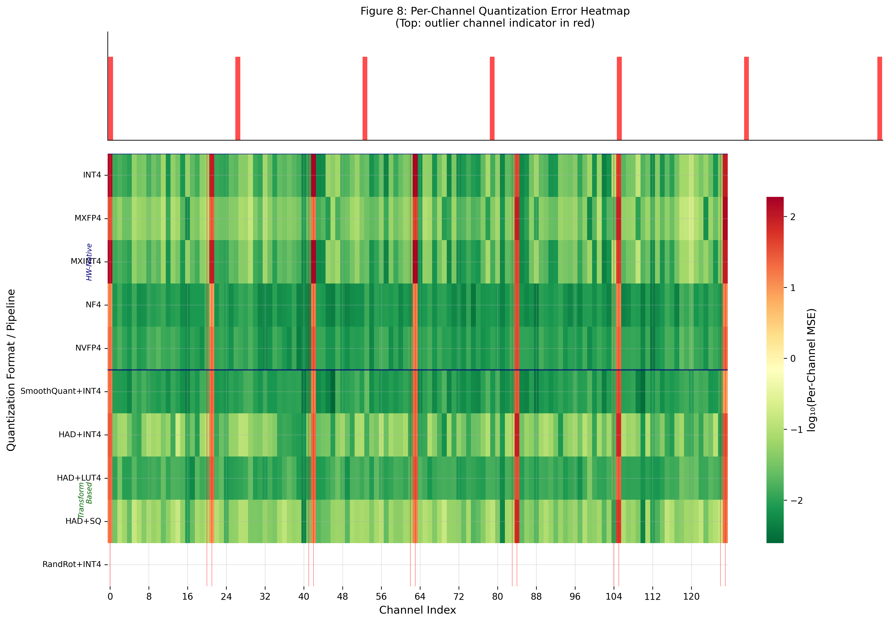

INT4: bright error stripes across ALL channels. MXFP4: red only at outlier channels. HAD+INT4: near-uniform green — FWHT redistributed outlier energy globally.

---

### Figure 9: Format Encoding Efficiency
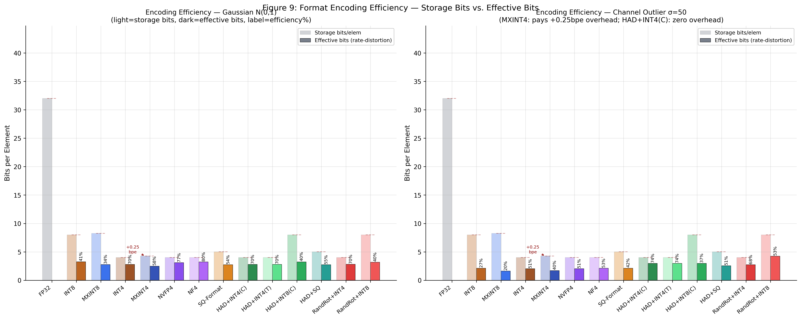

Storage bits vs. effective bits. On channel-outlier inputs, only HAD-based formats maintain high efficiency.

---

### Figure 10: Pipeline Latency Breakdown
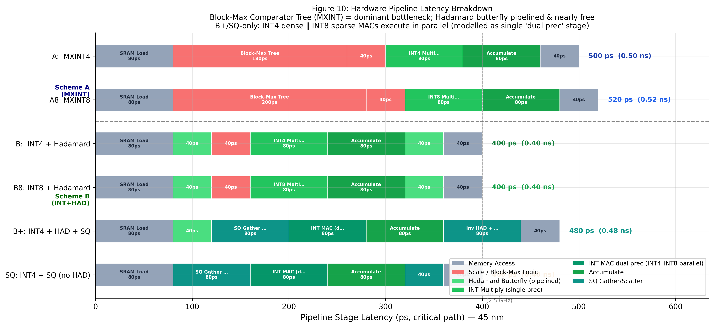

Stacked bar: critical-path latency per stage per scheme.

**Pipeline correctness model:**
- **MXINT**: Block-Max Comparator Tree (180–200 ps) is the dominant bottleneck — cannot be pipelined because the E8M0 scale must be computed before quantized multiplication begins.
- **HAD+INT**: Hadamard butterfly (40 ps, add/sub only) is fully pipelined and overlaps with SRAM load — adds near-zero critical-path overhead.
- **B+ / SQ-only**: INT4 (dense 99%) and INT8 (sparse 1%) multiply-accumulate units execute **in parallel** on dedicated hardware paths. Modelled as a single `INT MAC (dual prec)` stage at 80 ps — *not* sequential (which would incorrectly add 80 ps).

---

### Figure 11: Hardware Area Breakdown *(new)*
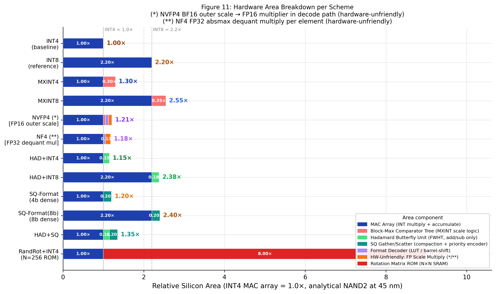

Stacked bar chart decomposing relative silicon area per scheme into components:
- **MAC Array** (blue): core INT multiply + accumulate PEs
- **Block-Max Scale Logic** (red): comparator tree for MXINT block maximum — dominant overhead in Scheme A
- **Hadamard Butterfly** (green): FWHT add/sub network — small fraction vs. MAC array
- **SQ Gather/Scatter** (teal): compaction + priority encoder + scatter mux
- **Format Decoder** (violet): LUT, barrel-shift decode
- **HW-Unfriendly FP ops** (orange): explicitly isolated FP scale multiply penalty for NVFP4 (BF16 outer scale) and NF4 (FP32 absmax dequant)
- **Rotation ROM** (red, RandRot only): N×N SRAM — dominates and makes RandRot impractical

All values normalised to INT4 MAC array = 1.0×.

---

## Hardware Comparison

### Scheme A: MXINT Systolic Array

```
Memory → [Block-Max Comparator Tree → E8M0 Broadcast] → INT MAC Array → Memory
```

- **Pro**: Hardware handles outliers natively; OCP standard interoperability
- **Con**: Block-max comparator tree (O(N) comparators) is area-heavy and on the critical path; +0.25 bpe metadata bandwidth tax
- **Area**: ~1.30× (INT4) / ~2.55× (INT8)

### Scheme B: INT Systolic Array + FWHT

```
Memory → [FWHT Butterfly (pipelined)] → INT MAC Array → [Inv FWHT (pipelined)] → Memory
```

- **Pro**: INT MAC is smallest/fastest arithmetic unit; FWHT is pipelined add/sub (nearly free in area); no metadata overhead
- **Con**: Requires power-of-2 dimension alignment; FWHT latency on first tile
- **Area**: ~1.15× (INT4) / ~2.38× (INT8) — **30–40% smaller than MXINT at same bit-width**

### Scheme B+: INT + FWHT + SQ Gather/Scatter

```
Memory → [SQ Gather (1%)] → [FWHT] → [INT4 MAC ‖ INT8 MAC (parallel)] → [Inv FWHT + Scatter] → Memory
```

- **Pro**: Handles extreme outliers (σ>100×); INT4 dense + INT8 sparse paths execute in parallel — no sequential penalty
- **Con**: Gather/Scatter units add ~0.20× area overhead vs Scheme B
- **Area**: ~1.35× (INT4 dominant)

---

## Conclusions

| Regime | Recommended Approach | Rationale |
|--------|---------------------|-----------|
| 8-bit, any outlier | MXINT8 or INT8+HAD | Both work well; choose based on ecosystem |
| 4-bit, mild outliers (≤10×) | HAD+INT4 | Lower area, equal quality to MXFP4 |
| 4-bit, moderate outliers (10–50×) | HAD+INT4 | FWHT global redistribution outperforms MXFP4 block scale |
| 4-bit, extreme outliers (>100×) | HAD+SQ | FWHT + sparse high-precision residual |
| Area-constrained | INT4+HAD (Scheme B) | 30–40% smaller than MXINT at same bit-width |
| Bandwidth-constrained | INT4+HAD | No metadata overhead vs. MX +0.25 bpe |
| Ecosystem/compatibility | MXFP4 | OCP standard, broad hardware support |
| Avoid (hardware cost) | NF4, FP6 in compute paths | FP32 scale multiply per element — prefer POT alternatives |

**The core verdict**: For 4-bit inference on outlier-heavy models (LLMs, ViTs), INT4 + FWHT (Scheme B) is Pareto-superior to MXFP4 on quality, area, and bandwidth simultaneously. MXFP formats retain value as an industry-standard interoperability layer and for models where outliers are mild.

**Hardware-friendliness caveat**: NVFP4 and NF4 carry hidden hardware costs from non-POT scaling that are not reflected in their bit-count alone. Their area and energy penalties are explicitly modelled in Figures 6 and 11. Formats using POT scales throughout (INT+HAD family, MX family) have no such hidden costs.

---

## Project Structure

```
dataformat/
├── config.py                    # Global constants (energy model, NF4 levels, roofline params)
├── run_all.py                   # Master pipeline (--fast, --skip-hw, --figs-only)
├── requirements.txt
│
├── formats/                     # All 24 quantization formats
│   ├── __init__.py              # build_all_formats(dim, seed) → dict[str, QuantFormat]
│   │                            # Includes SQ-Format (4b dense) and SQ-Format(8b) (8b dense)
│   ├── baseline.py              # FP32, BF16
│   ├── mxfp.py                  # MXFP4, MXFP8 (E8M0 block scale — HW-friendly)
│   ├── mxint.py                 # MXINT4, MXINT8 (E8M0 block scale — HW-friendly)
│   ├── nvfp4.py                 # NVFP4 (Blackwell E2M1; BF16 outer scale ⚠️ HW-unfriendly)
│   ├── nf4.py                   # NF4 (QLoRA; FP32 absmax dequant ⚠️ HW-unfriendly)
│   ├── fp6.py                   # FP6 E3M2 (FP32 scale + barrel-shift decode ⚠️ HW-unfriendly)
│   ├── sq_format.py             # SQ-Format (configurable dense_bits/sparse_bits; POT scales ✓)
│   └── transforms/
│       ├── hadamard.py          # FWHT butterfly (add/sub only; POT inverse; HW-friendly ✓)
│       ├── random_rotation.py   # Dense N×N orthogonal rotation (ROM) + TurboQuant (±1 XOR)
│       └── smoothquant.py       # Per-channel algebraic scale (FP32 ROM multiplies ⚠️)
│
├── distributions/               # Test input generators
│   ├── generators.py            # gaussian, spiky_outliers, channel_outliers, + 4 more
│   └── metrics.py               # mse, sqnr, kl_divergence, effective_bits, bops
│
├── experiments/                 # Experiment runners
│   ├── robustness.py            # Format × distribution × metric sweep
│   └── bitwidth_ablation.py     # 4-bit vs 8-bit regime study
│                                # Includes SQ-Format(8b) in 8-bit regime for direct comparison
│
├── hardware/                    # Hardware cost models
│   ├── energy_model.py          # Horowitz 45nm energy model (pJ/op)
│   ├── roofline.py              # Arithmetic intensity + roofline analysis
│   ├── bop_counter.py           # Bit operation counting for matmul + transforms
│   ├── ppa_evaluator.py         # Scheme A/B/B+ PPA via PyRTL + NAND2 analytical model
│   └── pyrtl_modules/           # PyRTL RTL definitions for each arithmetic unit
│
├── visualization/               # Figure generators (Figures 1–11)
│   ├── style.py                 # Global matplotlib style, PALETTE, MARKERS
│   ├── plot_distributions.py    # Fig 1: distribution evolution
│   ├── plot_outlier_heatmap.py  # Fig 2: precision-outlier sensitivity heatmap
│   ├── plot_pareto.py           # Fig 3 & 4: Pareto frontiers
│   ├── plot_had_vs_random.py    # Fig 5: HAD vs random rotation ablation
│   ├── plot_ppa_bubble.py       # Fig 6: PPA bubble (bubble = bandwidth b/elem)
│   ├── plot_roofline.py         # Fig 7: roofline model
│   ├── plot_channel_heatmap.py  # Fig 8: per-channel error heatmap
│   ├── plot_encoding_eff.py     # Fig 9: encoding efficiency
│   ├── plot_pipeline.py         # Fig 10: pipeline latency (corrected parallel dual-prec model)
│   └── plot_area.py             # Fig 11: hardware area breakdown (NEW)
│
├── tests/
│   └── test_formats.py          # Unit tests
│
└── results/
    └── figures/                 # Generated PNG + PDF figures (Fig 1–11)
```

---

## Citation

If you use this codebase, please cite:

```bibtex
@misc{outlier-format-study-2026,
  title  = {Outlier-Robust Quantization: Hardware-Native Formats vs. Transform-Based Methods},
  year   = {2026},
  note   = {Comparative study of 24 quantization formats across information theory, numerical accuracy, and hardware implementation cost dimensions}
}
```
