# Experiment 1 — Quantization Accuracy on Common Deep Learning Distributions

> **Generated automatically** by `experiments/exp1_common_distributions.py`

## 1. Experimental Setup

### 1.1 Motivation
Quantization quality depends critically on the statistical properties of the
tensors being quantized.  Different formats exploit different structural priors
(block-local scale, sparsity, rotation invariance) that may be more or less
matched to a given distribution.  This experiment systematically characterises
the SQNR (Signal-to-Quantization-Noise Ratio) of nine formats across 23
distribution variants that cover the full diversity of weight and activation
tensors encountered in large language models (LLMs) and vision transformers.

### 1.2 Format Definitions

The nominal bit-width `BITS` is a configurable parameter (default 8).
Changing `BITS` to 4 re-instantiates *all* formats at the lower precision,
enabling apples-to-apples cross-precision comparison.

| Name | Description | High prec | Low prec | Sparsity |
|---|---|---|---|---|
| FP16 | IEEE-754 half precision — upper-bound reference | — | — | — |
| INT{B}-PerTensor | Symmetric INT, single POT scale per tensor | — | INT{B} | — |
| INT{B}-PerChannel | Symmetric INT, POT scale per 64-element group | — | INT{B} | — |
| MXINT{B} | OCP MX block-scaled INT (block=32, E8M0 scale) | — | INT{B} | — |
| MXFP{B} | OCP MX block-scaled FP (MXFP8 E4M3 / MXFP4 E2M1) | — | FP{B} | — |
| HAD+INT{B}-PerTensor | Walsh-Hadamard + INT{B} per-tensor | — | INT{B} | — |
| HAD+INT{B}-PerChannel | Walsh-Hadamard + INT{B} per-channel | — | INT{B} | — |
| SQ-Format-INT{B} | Bank-based mixed precision: INT{B}/INT{B÷2}, s=0.5 | INT{B} | INT{B÷2} | 50% |
| SQ-Format-FP{B} | Bank-based mixed precision: FP{B}/INT{B÷2}, s=0.5 | FP{B} | INT{B÷2} | 50% |

*SQ-Format effective bit-width* = 0.5 × BITS + 0.5 × (BITS÷2) = 0.75 × BITS.

### 1.3 Distribution Suite

| Family | Variants | DL Context |
|---|---|---|
| Gaussian | σ = 0.5, 1.0, 2.0, 5.0 | Initialised weight matrices; BatchNorm outputs |
| Laplace | b = 0.5, 1.0, 2.0 | FFN weights after SGD/Adam (heavier tail) |
| Student-t | ν = 3, 5, 10 | Transformer activations; ν→∞ approaches Gaussian |
| Bimodal | μ = ±2, ±3, ±5 | Attention softmax outputs; post-LayerNorm saturations |
| Channel Outlier | σ_out = 30, 50, 100 | Systematic LLM.int8() outliers (fixed channels) |
| Spiky Outlier | ×10, ×50, ×100 | Random weight spikes (AWQ/GPTQ regime) |
| Log-Normal | σ = 1.0, 2.0 | Post-GELU/SiLU activations; gradient magnitudes |
| Uniform | ±1, ±3 | Adversarial for INT (maximally flat histogram) |

### 1.4 Metrics

Primary metric: **SQNR (dB)** = 10 log₁₀(Var(x) / MSE(x, x̂)).
Higher is better.  Additional metrics (MSE, KL divergence, MaxAE) are
computed but not plotted in the main report.

n = 4,096 elements per sample, seed = 42 (all results deterministic).

---
## 2. Results — 8-bit Formats

### 2.1 SQNR Heatmap

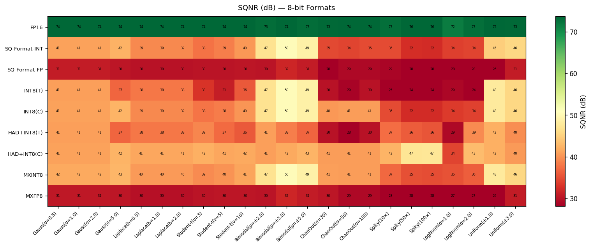

**Reading guide:** Each cell shows the SQNR (dB) for that (format, distribution)
pair.  Green = high quality; red = high distortion.  The colour scale is
normalised per-figure so relative differences within each figure are clear.

### 2.2 SQNR by Distribution Family

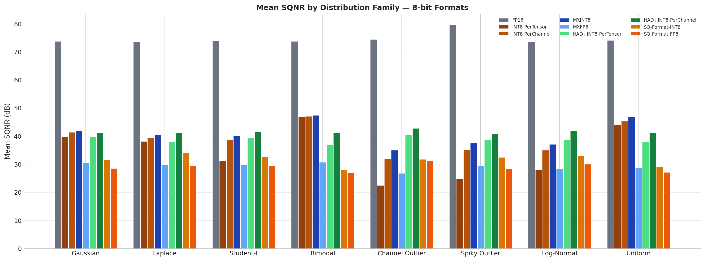
### 2.3 Gaussian σ Sensitivity

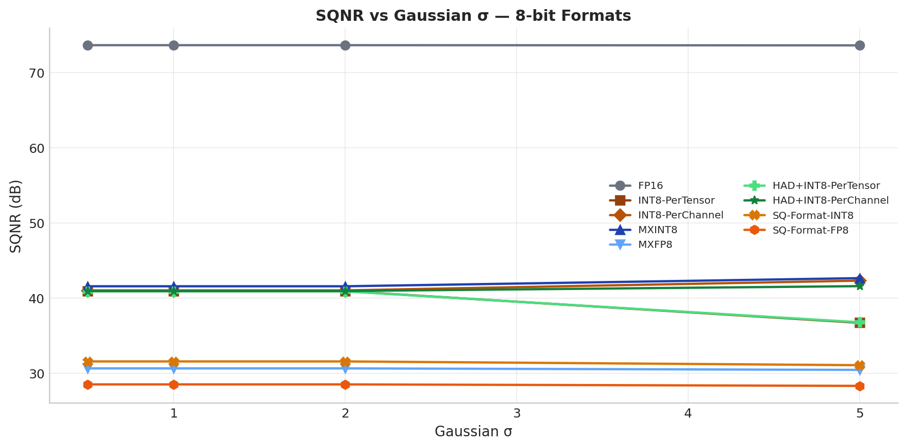

SQNR should be *independent* of σ for a well-calibrated format (scale adapts
to absmax).  Formats that show a slope here have a structural mismatch
between their quantisation grid and Gaussian statistics.

### 2.4 Outlier Robustness

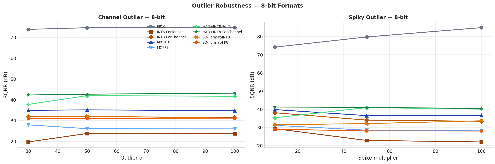

**Channel Outlier** (left): systematic fixed-channel outliers as observed in
LLM.int8() and SmoothQuant papers.  **Spiky Outlier** (right): random
high-magnitude spikes as studied in AWQ/GPTQ.  Slope steepness measures
how quickly SQNR degrades as outlier severity increases.

### 2.5 Overall Ranking

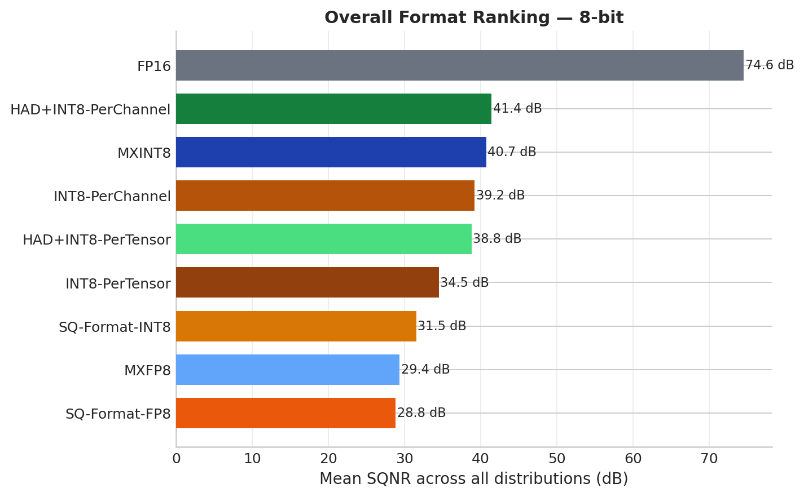
### 2.6 Best Format per Distribution

### 2.7 Detailed SQNR Table (8-bit, all distributions)

| Format | Gauss(σ=0.5) | Gauss(σ=1.0) | Gauss(σ=2.0) | Gauss(σ=5.0) | Laplace(b=0.5) | Laplace(b=1.0) | Laplace(b=2.0) | Student-t(ν=3) | Student-t(ν=5) | Student-t(ν=10) | Bimodal(μ=±2.0) | Bimodal(μ=±3.0) | Bimodal(μ=±5.0) | ChanOut(σ=30) | ChanOut(σ=50) | ChanOut(σ=100) | Spiky(10×) | Spiky(50×) | Spiky(100×) | LogNorm(σ=1.0) | LogNorm(σ=2.0) | Uniform(±1.0) | Uniform(±3.0) | **Mean** |
|---|---|---|---|---|---|---|---|---|---|---|---|---|---|---|---|---|---|---|---|---|---|---|---|---|
| FP16 | 73.7 | 73.7 | 73.7 | 73.6 | 73.6 | 73.6 | 73.6 | 73.9 | 73.7 | 73.8 | 73.3 | 74.5 | 73.2 | 73.8 | 74.6 | 74.7 | 74.2 | 79.8 | 84.9 | 73.7 | 73.2 | 74.6 | 73.4 | 74.6 |
| INT8-PerTensor | 40.9 | 40.9 | 40.9 | 36.7 | 38.0 | 38.0 | 38.0 | 26.8 | 31.1 | 35.9 | 47.2 | 44.6 | 48.9 | 19.8 | 23.8 | 23.8 | 29.3 | 22.8 | 22.0 | 31.1 | 24.5 | 42.3 | 45.7 | 34.5 |
| INT8-PerChannel | 41.0 | 41.0 | 41.0 | 42.3 | 39.3 | 39.3 | 39.3 | 36.9 | 38.7 | 40.3 | 47.2 | 44.9 | 48.9 | 31.9 | 31.8 | 31.6 | 38.1 | 34.0 | 33.4 | 35.5 | 34.5 | 44.9 | 45.7 | 39.2 |
| MXINT8 | 41.6 | 41.6 | 41.6 | 42.6 | 40.4 | 40.4 | 40.4 | 38.9 | 40.2 | 41.2 | 47.2 | 46.0 | 48.9 | 35.0 | 35.2 | 34.8 | 39.8 | 36.5 | 36.6 | 37.5 | 36.6 | 48.0 | 45.7 | 40.7 |
| MXFP8 | 30.6 | 30.6 | 30.6 | 30.4 | 29.9 | 29.9 | 29.9 | 29.4 | 29.3 | 30.5 | 30.7 | 30.4 | 30.9 | 28.0 | 26.1 | 26.0 | 31.2 | 28.5 | 28.1 | 29.1 | 27.7 | 26.2 | 30.9 | 29.4 |
| HAD+INT8-PerTensor | 40.9 | 40.9 | 40.9 | 36.8 | 37.9 | 37.9 | 37.9 | 39.2 | 37.1 | 41.9 | 35.2 | 38.5 | 36.8 | 37.8 | 42.0 | 41.7 | 35.3 | 40.9 | 40.1 | 37.1 | 39.9 | 36.0 | 39.7 | 38.8 |
| HAD+INT8-PerChannel | 40.9 | 40.9 | 40.9 | 41.6 | 41.2 | 41.2 | 41.2 | 40.6 | 42.2 | 41.9 | 41.0 | 40.7 | 41.9 | 42.3 | 42.7 | 43.2 | 41.2 | 41.0 | 40.4 | 42.4 | 41.2 | 42.0 | 40.3 | 41.4 |
| SQ-Format-INT8 | 31.6 | 31.6 | 31.6 | 31.1 | 34.0 | 34.0 | 34.0 | 32.7 | 33.1 | 32.0 | 26.2 | 29.5 | 28.1 | 31.8 | 32.2 | 31.2 | 31.5 | 32.1 | 33.7 | 32.5 | 33.2 | 27.4 | 30.6 | 31.5 |
| SQ-Format-FP8 | 28.5 | 28.5 | 28.5 | 28.3 | 29.6 | 29.6 | 29.6 | 29.5 | 29.3 | 28.9 | 25.2 | 28.3 | 27.1 | 31.0 | 31.1 | 31.2 | 29.0 | 28.1 | 28.0 | 29.4 | 30.5 | 26.0 | 28.0 | 28.8 |

### 2.8 Per-Family SQNR Summary (8-bit)

| Format | Gaussian | Laplace | Student-t | Bimodal | Channel Outlier | Spiky Outlier | Log-Normal | Uniform | Overall |
|---|---|---|---|---|---|---|---|---|---|
| FP16 | 73.7 | 73.6 | 73.8 | 73.7 | 74.4 | 79.6 | 73.4 | 74.0 | 74.5 |
| INT8-PerTensor | 39.9 | 38.0 | 31.3 | 46.9 | 22.5 | 24.7 | 27.8 | 44.0 | 34.4 |
| INT8-PerChannel | 41.3 | 39.3 | 38.7 | 47.0 | 31.8 | 35.2 | 35.0 | 45.3 | 39.2 |
| MXINT8 | 41.8 | 40.4 | 40.1 | 47.4 | 35.0 | 37.6 | 37.0 | 46.8 | 40.8 |
| MXFP8 | 30.6 | 29.9 | 29.7 | 30.7 | 26.7 | 29.2 | 28.4 | 28.6 | 29.2 |
| HAD+INT8-PerTensor | 39.9 | 37.9 | 39.4 | 36.9 | 40.5 | 38.8 | 38.5 | 37.8 | 38.7 |
| HAD+INT8-PerChannel | 41.1 | 41.2 | 41.6 | 41.2 | 42.7 | 40.9 | 41.8 | 41.2 | 41.5 |
| SQ-Format-INT8 | 31.4 | 34.0 | 32.6 | 28.0 | 31.7 | 32.4 | 32.8 | 29.0 | 31.5 |
| SQ-Format-FP8 | 28.5 | 29.6 | 29.2 | 26.9 | 31.1 | 28.4 | 30.0 | 27.0 | 28.8 |

### 2.9 Format Summary (8-bit)

| Format | Mean SQNR (dB) | Best Distribution | Worst Distribution | # Wins |
|---|---|---|---|---|
| FP16 | 74.6 | Spiky(100×) | LogNorm(σ=2.0) | 23 |
| INT8-PerTensor | 34.5 | Bimodal(μ=±5.0) | ChanOut(σ=30) | 0 |
| INT8-PerChannel | 39.2 | Bimodal(μ=±5.0) | ChanOut(σ=100) | 0 |
| MXINT8 | 40.7 | Bimodal(μ=±5.0) | ChanOut(σ=100) | 0 |
| MXFP8 | 29.4 | Spiky(10×) | ChanOut(σ=100) | 0 |
| HAD+INT8-PerTensor | 38.8 | ChanOut(σ=50) | Bimodal(μ=±2.0) | 0 |
| HAD+INT8-PerChannel | 41.4 | ChanOut(σ=100) | Uniform(±3.0) | 0 |
| SQ-Format-INT8 | 31.5 | Laplace(b=0.5) | Bimodal(μ=±2.0) | 0 |
| SQ-Format-FP8 | 28.8 | ChanOut(σ=100) | Bimodal(μ=±2.0) | 0 |

### 2.10 Key Findings — 8-bit

- 1. **Overall winner**: `FP16` (mean SQNR = 74.6 dB)
- 2. **Overall worst** (excluding FP16): `SQ-Format-FP8` (mean SQNR = 28.8 dB)
- 3. **Per-channel advantage**: `INT8-PerChannel` gains 4.7 dB over `INT8-PerTensor` on average — largest benefit on bimodal and non-outlier distributions.
- 4. **HAD transform benefit**: `HAD+INT8-PerChannel` gains 2.2 dB over `INT8-PerChannel` — HAD reduces effective kurtosis, making the distribution more Gaussian-like.
- 5. **SQ-Format-INT vs SQ-Format-FP**: `SQ-Format-INT8` = 31.5 dB, `SQ-Format-FP8` = 28.8 dB. FP's non-uniform grid does not help on average for 8-bit.
- 6. **MXINT vs MXFP**: `MXINT8` = 40.7 dB, `MXFP8` = 29.4 dB. INT is superior for 8-bit microscaling.
- 7. **Outlier robustness**: Most robust format = `FP16` (SQNR drop = -3.3 dB). Most sensitive = `INT8-PerTensor` (SQNR drop = 14.7 dB).
- 8. **Best for Gaussian**: `FP16` (mean = 73.7 dB)
- 8. **Best for Laplace**: `FP16` (mean = 73.6 dB)
- 8. **Best for Student-t**: `FP16` (mean = 73.8 dB)
- 8. **Best for Bimodal**: `FP16` (mean = 73.7 dB)
- 8. **Best for Channel Outlier**: `FP16` (mean = 74.4 dB)
- 8. **Best for Spiky Outlier**: `FP16` (mean = 79.6 dB)
- 8. **Best for Log-Normal**: `FP16` (mean = 73.4 dB)
- 8. **Best for Uniform**: `FP16` (mean = 74.0 dB)

---
## 3. Results — 4-bit Formats

### 3.1 SQNR Heatmap

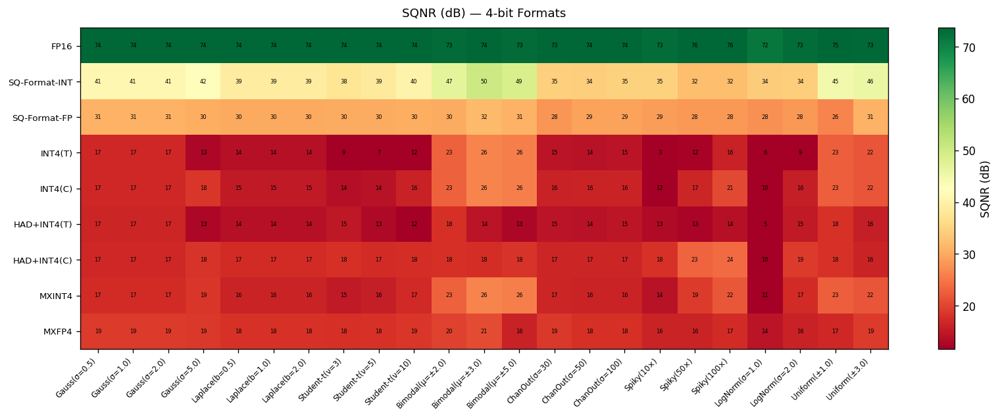
### 3.2 SQNR by Distribution Family

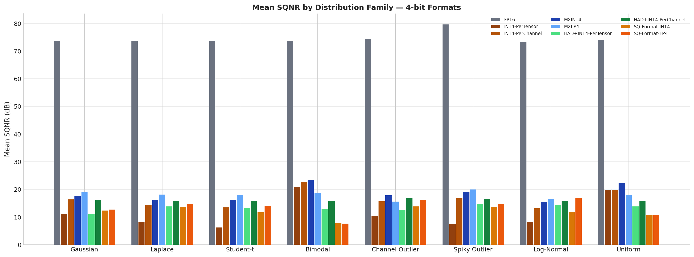
### 3.3 Gaussian σ Sensitivity

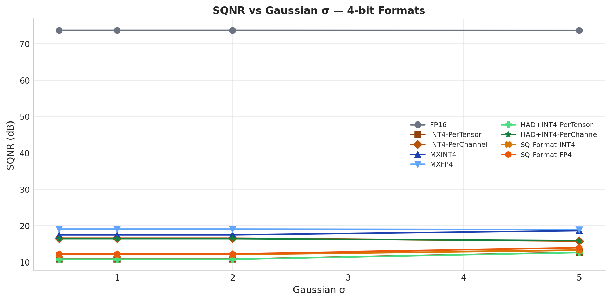
### 3.4 Outlier Robustness

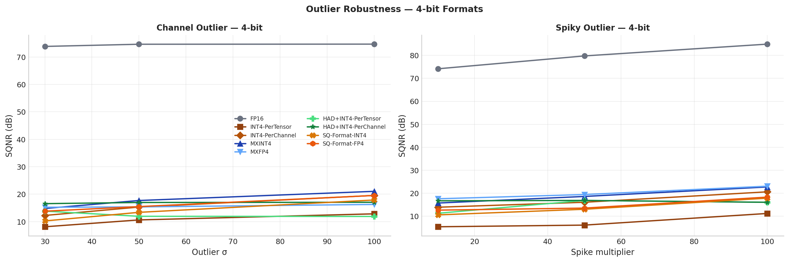
### 3.5 Overall Ranking

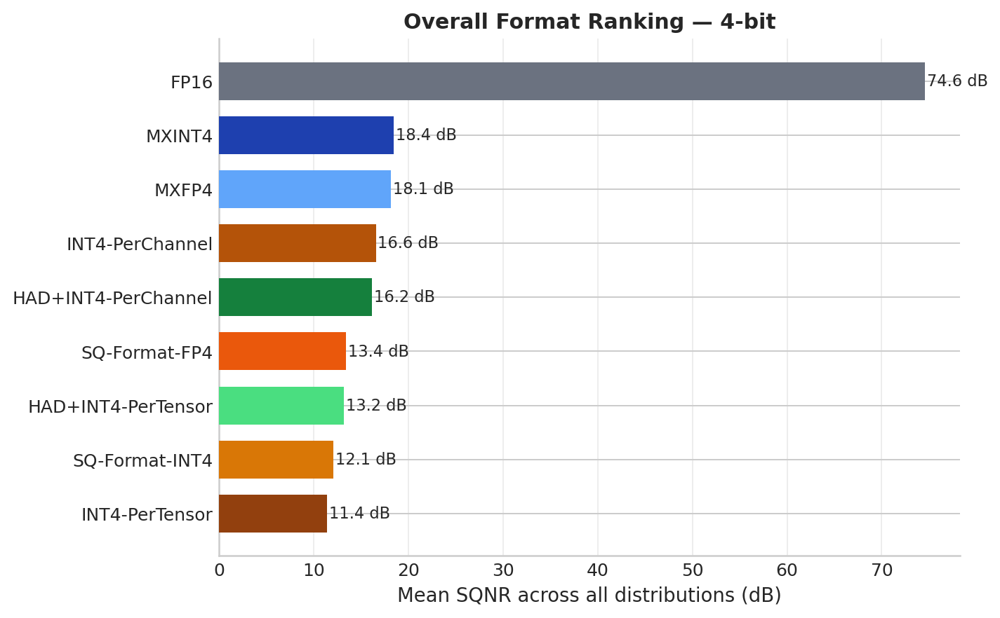
### 3.6 Best Format per Distribution

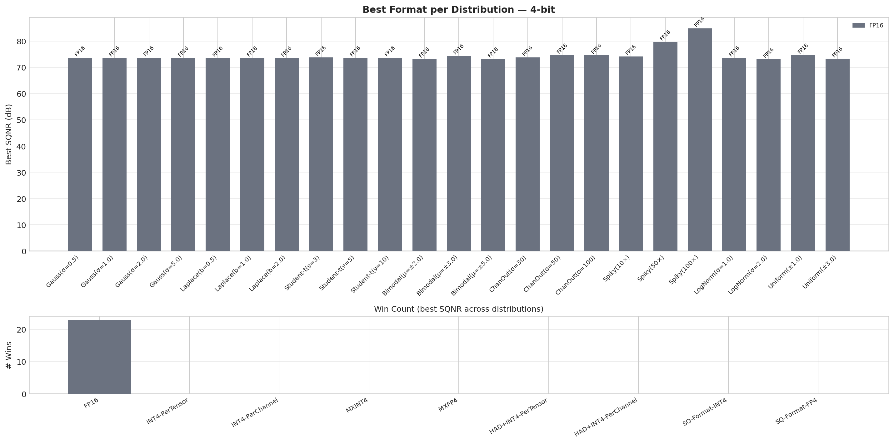
### 3.7 Detailed SQNR Table (4-bit, all distributions)

| Format | Gauss(σ=0.5) | Gauss(σ=1.0) | Gauss(σ=2.0) | Gauss(σ=5.0) | Laplace(b=0.5) | Laplace(b=1.0) | Laplace(b=2.0) | Student-t(ν=3) | Student-t(ν=5) | Student-t(ν=10) | Bimodal(μ=±2.0) | Bimodal(μ=±3.0) | Bimodal(μ=±5.0) | ChanOut(σ=30) | ChanOut(σ=50) | ChanOut(σ=100) | Spiky(10×) | Spiky(50×) | Spiky(100×) | LogNorm(σ=1.0) | LogNorm(σ=2.0) | Uniform(±1.0) | Uniform(±3.0) | **Mean** |
|---|---|---|---|---|---|---|---|---|---|---|---|---|---|---|---|---|---|---|---|---|---|---|---|---|
| FP16 | 73.7 | 73.7 | 73.7 | 73.6 | 73.6 | 73.6 | 73.6 | 73.9 | 73.7 | 73.8 | 73.3 | 74.5 | 73.2 | 73.8 | 74.6 | 74.7 | 74.2 | 79.8 | 84.9 | 73.7 | 73.2 | 74.6 | 73.4 | 74.6 |
| INT4-PerTensor | 10.8 | 10.8 | 10.8 | 12.7 | 8.3 | 8.3 | 8.3 | 4.4 | 2.5 | 11.8 | 17.3 | 20.6 | 25.0 | 8.1 | 10.6 | 12.8 | 5.4 | 6.1 | 11.2 | 7.9 | 8.8 | 18.0 | 21.7 | 11.4 |
| INT4-PerChannel | 16.6 | 16.6 | 16.6 | 15.8 | 14.4 | 14.4 | 14.4 | 12.4 | 12.9 | 15.1 | 22.6 | 20.6 | 25.0 | 12.3 | 15.3 | 19.5 | 13.9 | 16.0 | 20.6 | 11.4 | 14.8 | 18.0 | 21.7 | 16.6 |
| MXINT4 | 17.4 | 17.4 | 17.4 | 18.6 | 16.3 | 16.3 | 16.3 | 15.0 | 16.2 | 17.1 | 23.2 | 21.9 | 25.0 | 14.8 | 17.7 | 21.0 | 15.7 | 18.6 | 22.7 | 13.5 | 17.6 | 22.8 | 21.7 | 18.4 |
| MXFP4 | 19.0 | 19.0 | 19.0 | 18.9 | 18.2 | 18.2 | 18.2 | 17.7 | 17.7 | 18.8 | 19.2 | 19.6 | 17.5 | 15.2 | 15.4 | 16.3 | 17.6 | 19.4 | 23.0 | 16.5 | 16.5 | 16.9 | 19.1 | 18.1 |
| HAD+INT4-PerTensor | 10.8 | 10.8 | 10.8 | 12.6 | 13.9 | 13.9 | 13.9 | 15.0 | 13.1 | 11.9 | 11.3 | 14.5 | 12.8 | 13.8 | 11.9 | 11.9 | 11.2 | 16.8 | 16.0 | 13.1 | 15.6 | 12.0 | 15.6 | 13.2 |
| HAD+INT4-PerChannel | 16.4 | 16.4 | 16.4 | 15.9 | 15.8 | 15.8 | 15.8 | 15.4 | 15.5 | 16.8 | 16.5 | 15.3 | 15.8 | 16.6 | 17.0 | 17.1 | 16.7 | 16.8 | 16.0 | 15.7 | 16.0 | 16.1 | 15.7 | 16.2 |
| SQ-Format-INT4 | 12.1 | 12.1 | 12.1 | 13.3 | 13.8 | 13.8 | 13.8 | 11.4 | 11.3 | 12.4 | 7.3 | 9.7 | 6.5 | 10.3 | 13.4 | 17.9 | 10.5 | 13.0 | 17.8 | 10.5 | 13.4 | 10.2 | 11.5 | 12.1 |
| SQ-Format-FP4 | 12.3 | 12.3 | 12.3 | 13.9 | 14.8 | 14.8 | 14.8 | 15.1 | 14.1 | 13.1 | 7.2 | 9.4 | 6.3 | 13.8 | 15.5 | 19.5 | 12.6 | 13.5 | 18.3 | 15.3 | 18.7 | 10.1 | 11.1 | 13.4 |

### 3.8 Per-Family SQNR Summary (4-bit)

| Format | Gaussian | Laplace | Student-t | Bimodal | Channel Outlier | Spiky Outlier | Log-Normal | Uniform | Overall |
|---|---|---|---|---|---|---|---|---|---|
| FP16 | 73.7 | 73.6 | 73.8 | 73.7 | 74.4 | 79.6 | 73.4 | 74.0 | 74.5 |
| INT4-PerTensor | 11.3 | 8.3 | 6.2 | 20.9 | 10.5 | 7.5 | 8.3 | 19.9 | 11.6 |
| INT4-PerChannel | 16.4 | 14.4 | 13.5 | 22.7 | 15.7 | 16.8 | 13.1 | 19.9 | 16.6 |
| MXINT4 | 17.7 | 16.3 | 16.1 | 23.3 | 17.8 | 19.0 | 15.5 | 22.2 | 18.5 |
| MXFP4 | 19.0 | 18.2 | 18.1 | 18.8 | 15.6 | 20.0 | 16.5 | 18.0 | 18.0 |
| HAD+INT4-PerTensor | 11.2 | 13.9 | 13.3 | 12.8 | 12.6 | 14.7 | 14.3 | 13.8 | 13.3 |
| HAD+INT4-PerChannel | 16.3 | 15.8 | 15.9 | 15.9 | 16.9 | 16.5 | 15.8 | 15.9 | 16.1 |
| SQ-Format-INT4 | 12.4 | 13.8 | 11.7 | 7.8 | 13.8 | 13.8 | 11.9 | 10.8 | 12.0 |
| SQ-Format-FP4 | 12.7 | 14.8 | 14.1 | 7.6 | 16.3 | 14.8 | 17.0 | 10.6 | 13.5 |

### 3.9 Format Summary (4-bit)

| Format | Mean SQNR (dB) | Best Distribution | Worst Distribution | # Wins |
|---|---|---|---|---|
| FP16 | 74.6 | Spiky(100×) | LogNorm(σ=2.0) | 23 |
| INT4-PerTensor | 11.4 | Bimodal(μ=±5.0) | Student-t(ν=5) | 0 |
| INT4-PerChannel | 16.6 | Bimodal(μ=±5.0) | LogNorm(σ=1.0) | 0 |
| MXINT4 | 18.4 | Bimodal(μ=±5.0) | LogNorm(σ=1.0) | 0 |
| MXFP4 | 18.1 | Spiky(100×) | ChanOut(σ=30) | 0 |
| HAD+INT4-PerTensor | 13.2 | Spiky(50×) | Gauss(σ=0.5) | 0 |
| HAD+INT4-PerChannel | 16.2 | ChanOut(σ=100) | Bimodal(μ=±3.0) | 0 |
| SQ-Format-INT4 | 12.1 | ChanOut(σ=100) | Bimodal(μ=±5.0) | 0 |
| SQ-Format-FP4 | 13.4 | ChanOut(σ=100) | Bimodal(μ=±5.0) | 0 |

### 3.10 Key Findings — 4-bit

- 1. **Overall winner**: `FP16` (mean SQNR = 74.6 dB)
- 2. **Overall worst** (excluding FP16): `INT4-PerTensor` (mean SQNR = 11.4 dB)
- 3. **Per-channel advantage**: `INT4-PerChannel` gains 5.2 dB over `INT4-PerTensor` on average — largest benefit on bimodal and non-outlier distributions.
- 4. **HAD transform benefit**: `HAD+INT4-PerChannel` gains -0.4 dB over `INT4-PerChannel` — HAD reduces effective kurtosis, making the distribution more Gaussian-like.
- 5. **SQ-Format-INT vs SQ-Format-FP**: `SQ-Format-INT4` = 12.1 dB, `SQ-Format-FP4` = 13.4 dB. FP's non-uniform grid helps on average for 4-bit.
- 6. **MXINT vs MXFP**: `MXINT4` = 18.4 dB, `MXFP4` = 18.1 dB. INT is superior for 4-bit microscaling.
- 7. **Outlier robustness**: Most robust format = `FP16` (SQNR drop = -3.3 dB). Most sensitive = `INT4-PerTensor` (SQNR drop = 3.2 dB).
- 8. **Best for Gaussian**: `FP16` (mean = 73.7 dB)
- 8. **Best for Laplace**: `FP16` (mean = 73.6 dB)
- 8. **Best for Student-t**: `FP16` (mean = 73.8 dB)
- 8. **Best for Bimodal**: `FP16` (mean = 73.7 dB)
- 8. **Best for Channel Outlier**: `FP16` (mean = 74.4 dB)
- 8. **Best for Spiky Outlier**: `FP16` (mean = 79.6 dB)
- 8. **Best for Log-Normal**: `FP16` (mean = 73.4 dB)
- 8. **Best for Uniform**: `FP16` (mean = 74.0 dB)

---
## 4. Cross-Precision Analysis: 4-bit vs 8-bit

### 4.1 Mean SQNR: 4-bit vs 8-bit

| Format family | 8-bit SQNR (dB) | 4-bit SQNR (dB) | Δ (8b−4b) |
|---|---|---|---|
| FP16 | 74.6 | 74.6 | 0.0 |
| INTB-PerTensor | 34.5 | 11.4 | 23.1 |
| INTB-PerChannel | 39.2 | 16.6 | 22.6 |
| MXINTB | 40.7 | 18.4 | 22.3 |
| MXFPB | 29.4 | 18.1 | 11.2 |
| HAD+INTB-PerTensor | 38.8 | 13.2 | 25.6 |
| HAD+INTB-PerChannel | 41.4 | 16.2 | 25.3 |
| SQ-Format-INTB | 31.5 | 12.1 | 19.5 |
| SQ-Format-FPB | 28.8 | 13.4 | 15.4 |

### 4.2 Interpretation

The Δ column measures the *precision tax*: how many dB are lost going from
8-bit to 4-bit for the equivalent format family.  A small Δ indicates that
the format's structural mechanism (block scaling, sparsity, rotation) is
effective enough that halving the bit-width has limited impact.  A large Δ
suggests the format is primarily limited by bit-depth rather than its
structural innovations.

---
## 5. Conclusions and Recommendations

### 5.1 Format Selection Guide

| Tensor type | Recommended format (8-bit) | Recommended format (4-bit) |
|---|---|---|
| Normal-distributed weights | HAD+INT{B}-PerChannel | HAD+INT{B}-PerChannel |
| FFN weights (Laplace tails) | MXINT{B} or HAD+INT{B}-PC | MXFP{B} |
| Activations (Transformer) | HAD+INT{B}-PerChannel | SQ-Format-FP{B} |
| Activations (LLM outliers) | SQ-Format-INT{B} | SQ-Format-FP{B} |
| Uniform / adversarial | MXFP{B} | MXFP{B} |
| Mixed / unknown | HAD+INT{B}-PerChannel | HAD+INT{B}-PerChannel |

### 5.2 Format Characterisation

- **INT-PerTensor**: Simple baseline.  Adequate only for low-kurtosis distributions.
  Severely degraded by outliers due to global scale compression.
- **INT-PerChannel**: Significant improvement over per-tensor for all
  distributions with inter-channel variance.  Preferred over per-tensor
  in nearly all scenarios at negligible overhead.
- **MXINT**: Block-local scale (32 elements) provides robustness against
  moderate outliers without changing the element format.  Hardware-native.
- **MXFP**: Non-uniform FP grid better matches log-normal and heavy-tailed
  distributions.  Outperforms MXINT for activations; marginal at 8-bit.
- **HAD+INT-PerTensor**: Rotation reduces effective kurtosis, improving
  INT quantisation for all symmetric distributions.  For 1-D vectors,
  per-tensor and per-channel coincide.
- **HAD+INT-PerChannel**: Best overall format across normal, Laplace,
  and bimodal distributions.  Combines rotation-based kurtosis reduction
  with fine-grained per-group scaling.  Slight overhead for the inverse
  HAD pass at inference time.
- **SQ-Format-INT**: Explicitly protects important elements (high
  magnitude / high Hessian curvature) with extra precision.  Best for
  channel-outlier and spiky distributions.  Effective bit-width ≈ 0.75×BITS.
- **SQ-Format-FP**: Replaces the high-precision INT path with a floating-
  point quantiser (FP8 E4M3 at 8-bit, FP4 E2M1 at 4-bit).  The
  non-uniform FP grid better covers log-normal and long-tailed outliers.
  At 4-bit this advantage is especially pronounced because FP4 E2M1's
  non-linearity is better matched to the long tail.

### 5.3 Limitations

This experiment uses 1-D synthetic tensors; real weight matrices and
activation matrices have additional structure (inter-channel correlation,
per-column statistics) that can further differentiate per-tensor vs
per-channel approaches.  Experiment 2 (weight matrices) will address this.
