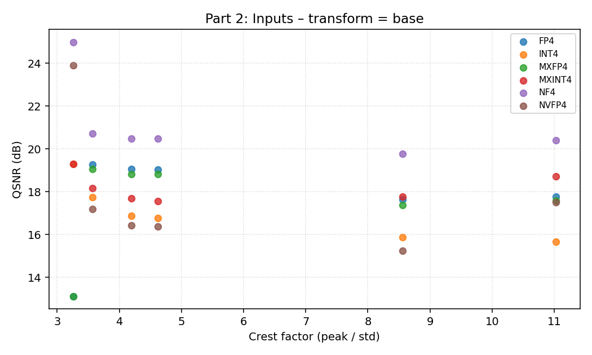
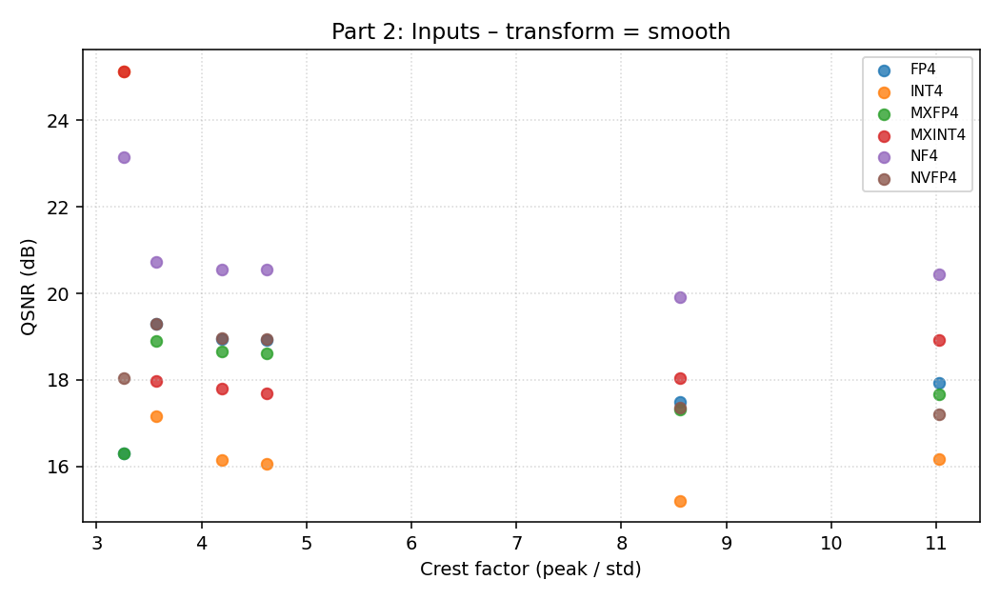
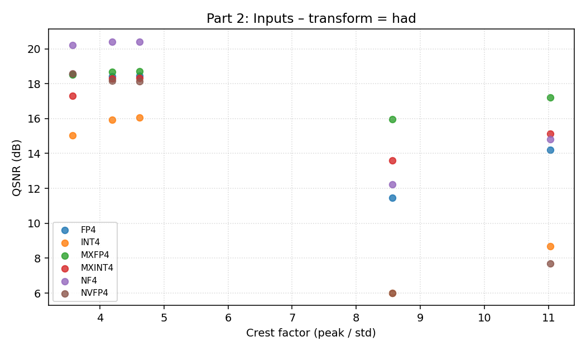
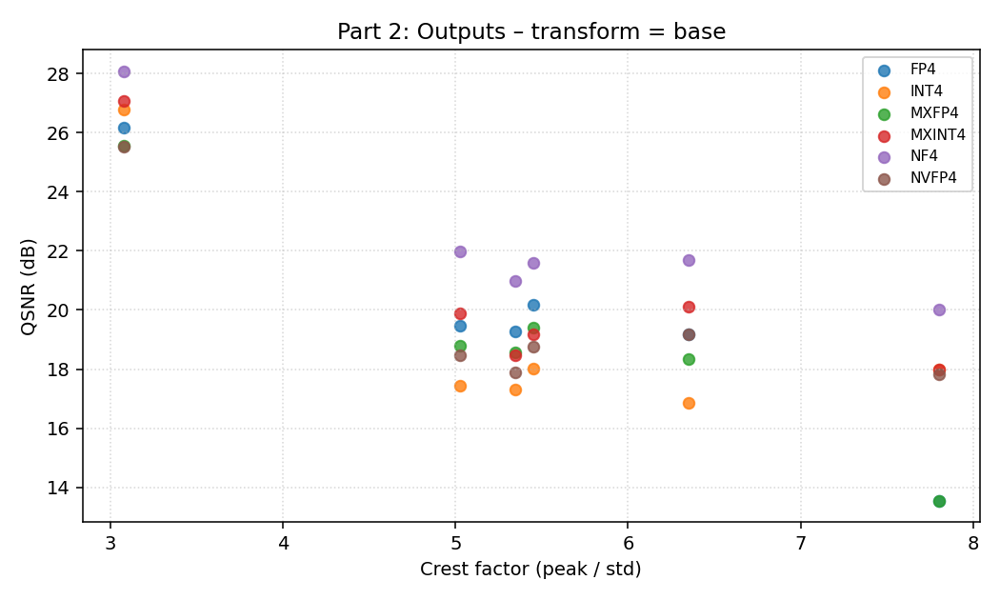
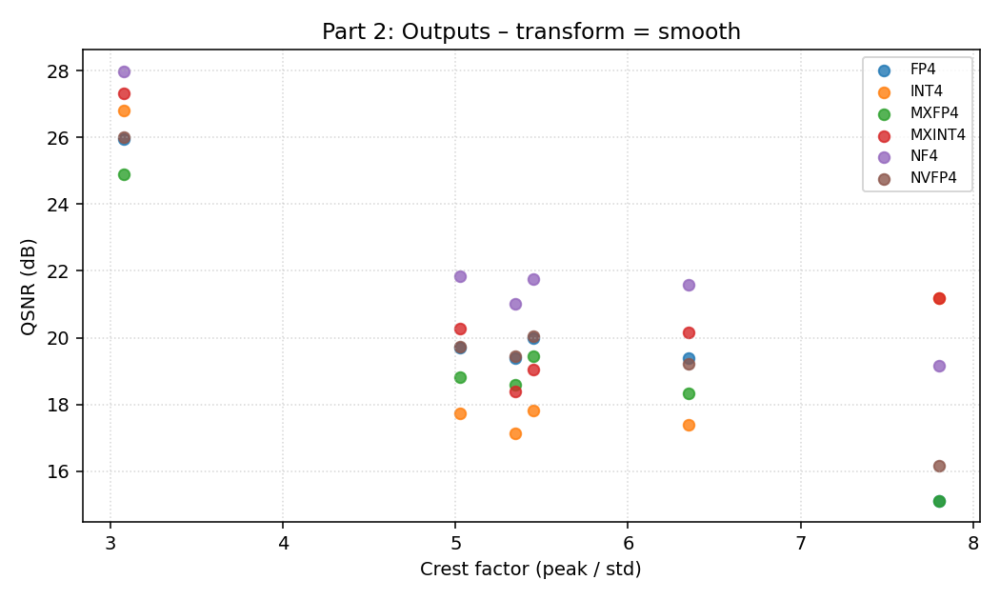
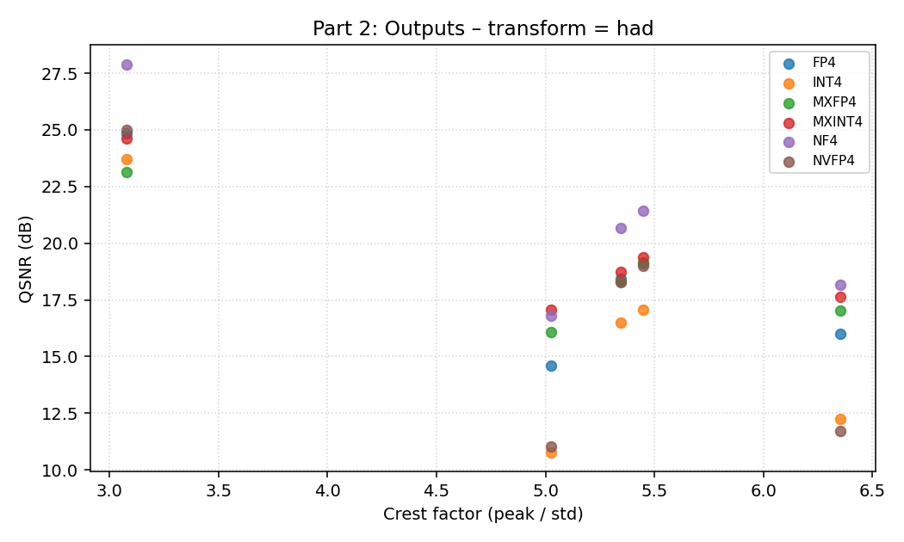
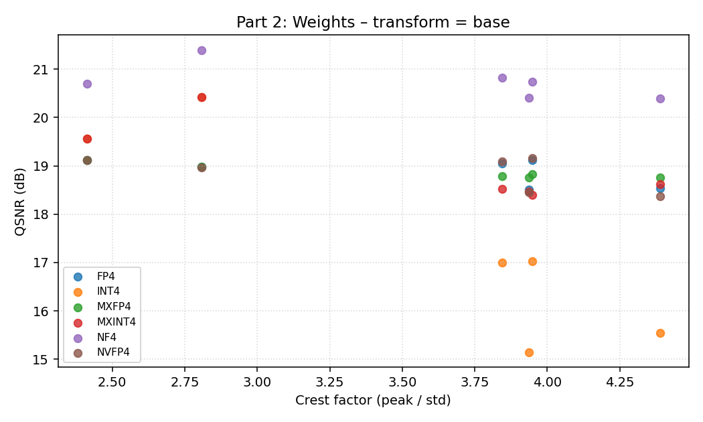
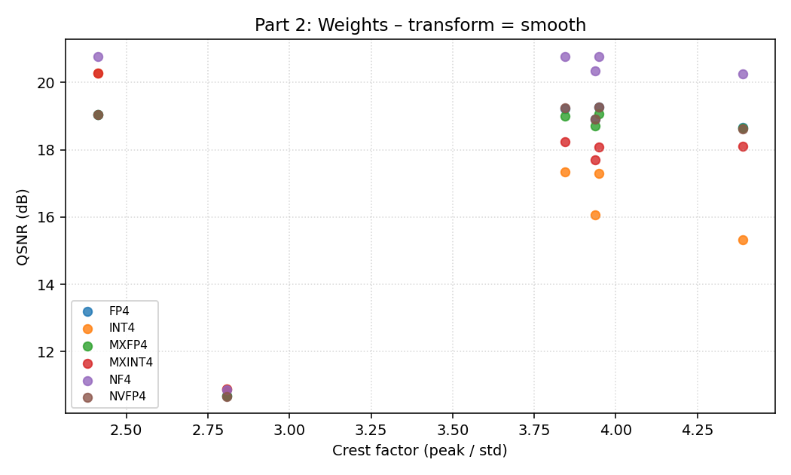
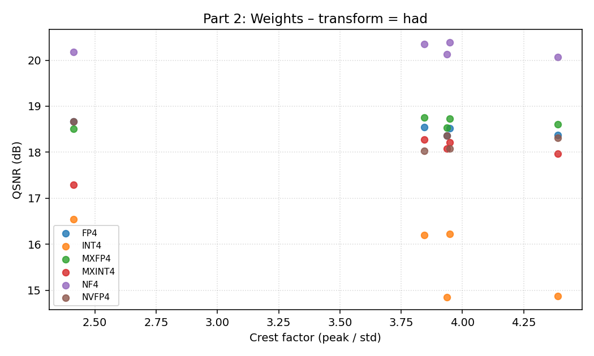

# 4-bit Data Format Study — Report

Compares six 4-bit formats (**INT4, FP4, NF4, NVFP4, MXINT4, MXFP4**) under three transforms (**base, smooth, had**) across synthetic distributions (Part 1) and a real MNIST Transformer (Part 2).

Formats: `INT4`, `FP4`, `NF4` use per-channel absmax (POT scale for INT4 / FP4, float scale for NF4). `NVFP4` is per-tensor E2M1. `MXINT4`, `MXFP4` use OCP-MX block scaling (block size 32).

## Part 1 — Synthetic Distribution Analysis
### 1.1 Direct quantization of common distributions
QSNR (dB) — higher is better.

| distribution | INT4 | FP4 | NF4 | NVFP4 | MXINT4 | MXFP4 |
|---|---|---|---|---|---|---|
| Bimodal(μ=±3) | 20.61 | 20.63 | 21.72 | 20.63 | 21.91 | 19.63 |
| ChannelOutlier(σ=100) | 16.29 | 15.37 | 17.50 | 15.37 | 21.04 | 16.26 |
| ChannelOutlier(σ=30) | 8.13 | 8.67 | 8.90 | 8.67 | 14.79 | 15.24 |
| Gaussian(σ=1) | 16.75 | 19.07 | 19.36 | 19.07 | 17.43 | 19.04 |
| Laplace(b=1) | 14.01 | 17.74 | 16.78 | 17.74 | 16.31 | 18.16 |
| LogNormal(σ=1) | 7.90 | 12.57 | 12.47 | 12.57 | 13.53 | 16.53 |
| Spiky(50×) | 6.08 | 6.72 | 6.58 | 6.72 | 18.56 | 19.40 |
| Student-t(ν=10) | 11.83 | 17.01 | 17.23 | 17.01 | 17.12 | 18.84 |
| Student-t(ν=3) | 4.39 | 9.09 | 8.88 | 9.09 | 15.01 | 17.71 |

### 1.2 Linear Y = X W^T, base quantization only — Y QSNR (dB)
| W/X distribution | INT4 | FP4 | NF4 | NVFP4 | MXINT4 | MXFP4 |
|---|---|---|---|---|---|---|
| AttentionQKV | 15.83 | 17.01 | 18.80 | 14.91 | 16.95 | 16.82 |
| FFN-UpProjection | 9.30 | 13.88 | 14.88 | 10.07 | 12.85 | 14.87 |
| TransformerTypical | 12.04 | 15.27 | 16.71 | 14.34 | 14.70 | 15.72 |

### 1.3 Smooth-friendly pairs — base / smooth / had transforms
**Transform: `base` — Y QSNR (dB)**

| distribution | INT4 | FP4 | NF4 | NVFP4 | MXINT4 | MXFP4 |
|---|---|---|---|---|---|---|
| SmoothFriendly-Balanced | 8.73 | 11.07 | 11.03 | 4.26 | 14.00 | 14.29 |
| SmoothFriendly-Mild | 10.55 | 12.15 | 13.05 | 10.95 | 13.60 | 13.94 |
| SmoothFriendly-Severe | 13.62 | 14.37 | 17.13 | 14.37 | 16.55 | 14.87 |

**Transform: `smooth` — Y QSNR (dB)**

| distribution | INT4 | FP4 | NF4 | NVFP4 | MXINT4 | MXFP4 |
|---|---|---|---|---|---|---|
| SmoothFriendly-Balanced | 14.24 | 13.94 | 17.83 | 9.72 | 19.33 | 14.05 |
| SmoothFriendly-Mild | 13.55 | 14.86 | 17.75 | 12.25 | 17.55 | 14.36 |
| SmoothFriendly-Severe | 16.52 | 14.63 | 20.14 | 14.40 | 19.60 | 14.32 |

**Transform: `had` — Y QSNR (dB)**

| distribution | INT4 | FP4 | NF4 | NVFP4 | MXINT4 | MXFP4 |
|---|---|---|---|---|---|---|
| SmoothFriendly-Balanced | 12.55 | 15.76 | 14.70 | 4.91 | 14.93 | 14.87 |
| SmoothFriendly-Mild | 13.29 | 15.74 | 17.31 | 14.35 | 15.51 | 16.09 |
| SmoothFriendly-Severe | 13.50 | 15.81 | 17.35 | 15.24 | 15.72 | 15.82 |


## Part 2 — Real Model Analysis (MNIST Transformer)

Profiled a trained MNISTTransformer on a held-out test subset. For every `nn.Linear` layer the profiler records the weight matrix, the batch of inputs, and the FP32 output reference. QSNR is then computed for every (format × transform) combination, including the full quantized linear simulation for the output.

### Figures — Crest Factor vs QSNR
**Input**

*base*



*smooth*



*had*



**Output**

*base*



*smooth*



*had*



**Weight**

*base*



*smooth*



*had*



### Table 1 — Per-layer QSNR detail

**Table 1 — Per-layer output QSNR (dB) grouped by transform.**

*Transform: base*

| layer | INT4 | FP4 | NF4 | NVFP4 | MXINT4 | MXFP4 |
|---|---|---|---|---|---|---|
| classifier | 26.79 | 26.16 | 28.07 | 25.54 | 27.08 | 25.56 |
| embed | 17.98 | 13.54 | 20.00 | 17.83 | 17.98 | 13.54 |
| encoder.layers.0.linear1 | 17.32 | 19.28 | 20.98 | 17.89 | 18.47 | 18.56 |
| encoder.layers.0.linear2 | 16.87 | 19.18 | 21.68 | 19.19 | 20.12 | 18.35 |
| encoder.layers.1.linear1 | 18.03 | 20.16 | 21.60 | 18.75 | 19.18 | 19.40 |
| encoder.layers.1.linear2 | 17.43 | 19.48 | 21.97 | 18.45 | 19.88 | 18.80 |

*Transform: smooth*

| layer | INT4 | FP4 | NF4 | NVFP4 | MXINT4 | MXFP4 |
|---|---|---|---|---|---|---|
| classifier | 26.82 | 25.95 | 27.98 | 26.02 | 27.32 | 24.88 |
| embed | 21.19 | 15.11 | 19.16 | 16.18 | 21.19 | 15.11 |
| encoder.layers.0.linear1 | 17.12 | 19.38 | 21.01 | 19.43 | 18.40 | 18.60 |
| encoder.layers.0.linear2 | 17.38 | 19.38 | 21.58 | 19.22 | 20.16 | 18.33 |
| encoder.layers.1.linear1 | 17.83 | 20.00 | 21.74 | 20.05 | 19.06 | 19.43 |
| encoder.layers.1.linear2 | 17.72 | 19.70 | 21.84 | 19.72 | 20.26 | 18.81 |

*Transform: had*

| layer | INT4 | FP4 | NF4 | NVFP4 | MXINT4 | MXFP4 |
|---|---|---|---|---|---|---|
| classifier | 23.71 | 24.85 | 27.89 | 25.00 | 24.63 | 23.12 |
| encoder.layers.0.linear1 | 16.49 | 18.42 | 20.67 | 18.27 | 18.72 | 18.33 |
| encoder.layers.0.linear2 | 12.24 | 15.99 | 18.18 | 11.72 | 17.64 | 17.03 |
| encoder.layers.1.linear1 | 17.05 | 19.11 | 21.43 | 19.00 | 19.37 | 19.17 |
| encoder.layers.1.linear2 | 10.77 | 14.61 | 16.81 | 11.03 | 17.06 | 16.06 |


### Table 2 — Per-layer best transform + per-format optimal-combination QSNR

**Table 2 — Best transform per layer per format + per-format optimal-combination summary.**

*Per-layer best transform (best QSNR in dB).*

| layer | INT4 | FP4 | NF4 | NVFP4 | MXINT4 | MXFP4 |
|---|---|---|---|---|---|---|
| classifier | smooth (26.82) | base (26.16) | base (28.07) | smooth (26.02) | smooth (27.32) | base (25.56) |
| embed | smooth (21.19) | smooth (15.11) | base (20.00) | base (17.83) | smooth (21.19) | smooth (15.11) |
| encoder.layers.0.linear1 | base (17.32) | smooth (19.38) | smooth (21.01) | smooth (19.43) | had (18.72) | smooth (18.60) |
| encoder.layers.0.linear2 | smooth (17.38) | smooth (19.38) | base (21.68) | smooth (19.22) | smooth (20.16) | base (18.35) |
| encoder.layers.1.linear1 | base (18.03) | base (20.16) | smooth (21.74) | smooth (20.05) | had (19.37) | smooth (19.43) |
| encoder.layers.1.linear2 | smooth (17.72) | smooth (19.70) | base (21.97) | smooth (19.72) | smooth (20.26) | smooth (18.81) |

*Per-format optimal-combination QSNR summary (mean over layers).*

| format | mean_qsnr_db | median_qsnr_db | min_qsnr_db | transform_split |
|---|---|---|---|---|
| INT4 | 19.74 | 17.87 | 17.32 | base:2/6 / smooth:4/6 / had:0/6 |
| FP4 | 19.98 | 19.54 | 15.11 | base:2/6 / smooth:4/6 / had:0/6 |
| NF4 | 22.41 | 21.71 | 20.00 | base:4/6 / smooth:2/6 / had:0/6 |
| NVFP4 | 20.38 | 19.58 | 17.83 | base:1/6 / smooth:5/6 / had:0/6 |
| MXINT4 | 21.17 | 20.21 | 18.72 | base:0/6 / smooth:4/6 / had:2/6 |
| MXFP4 | 19.31 | 18.71 | 15.11 | base:2/6 / smooth:4/6 / had:0/6 |

## Appendix — Configuration

```
n_samples          = 4096
batch_size         = 128
in_features        = 256  (must be power of 2 for HAD)
out_features       = 128
smooth_alpha       = 0.5
profile_samples    = 256
seed               = 42
formats            = ['INT4', 'FP4', 'NF4', 'NVFP4', 'MXINT4', 'MXFP4']
transforms         = ['base', 'smooth', 'had']
```
