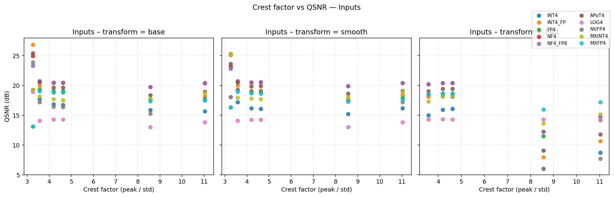
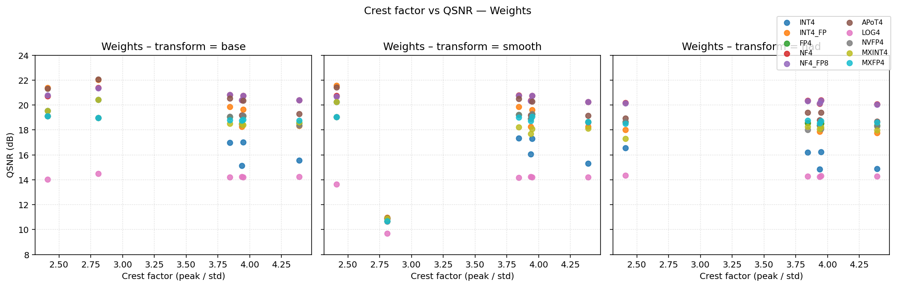
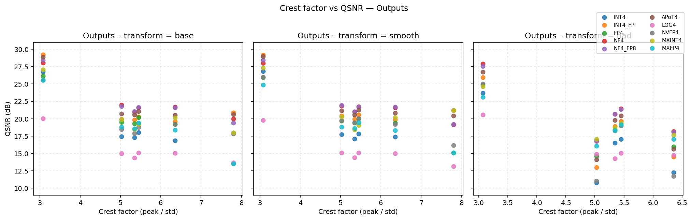
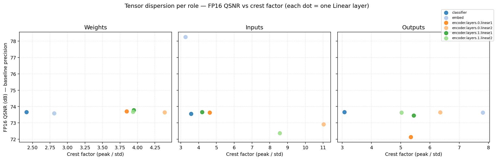

# 4-bit Data Format Study — Report (W4A4)

Compares ten 4-bit formats under three transforms (**base, smooth, had**) across synthetic distributions (Part 1) and a real MNIST Transformer (Part 2).

**Quantisation regime — W4A4.** Every linear layer has both its **weights** and its **input activations** quantised to 4 bits. The matmul accumulator is kept at FP32 (matching real W4A4 tensor cores — the 4-bit product routinely overflows into 11+ bits after the in-feature reduction, so re-quantising the accumulator back to 4 bits is **not** done inside a single layer).  The next layer's input becomes 4-bit again at *its* entry, so end-to-end accuracy errors accumulate across the stacked layers — this is captured by the accuracy sweep in Table 3.

**Format set and hardware notes.**  `INT4` uses a symmetric power-of-two per-channel scale (pure shift decode). `INT4_FP` is the same level set with an unrestricted FP per-channel scale — isolating 'POT overhead' from 'level-set choice'. `FP4` is the E2M1 set with POT per-channel scale. `NF4` places its 16 levels at Gaussian quantiles (QLoRA) and uses a full-FP per-channel scale; `NF4_FP8` is the hardware-realistic variant (QLoRA double-quantisation: scale stored in FP8-E4M3). `APoT4` uses 8 positive additive-PoT levels (multiplier-free decode). `LOG4` keeps only powers of two — shift-only decode, coarsest resolution. `NVFP4` is the Blackwell per-tensor E2M1. `MXINT4`/`MXFP4` are OCP-MX block-scaled (block = 32).

## Part 1 — Synthetic Distribution Analysis
### 1.1 Direct quantization of common distributions
QSNR (dB) — higher is better.  `FP16 (baseline)` is the QSNR of simply rounding the tensor to half-precision — the upper bound for *any* 4-bit format on this distribution.

| distribution | FP16 (baseline) | INT4 | INT4_FP | FP4 | NF4 | NF4_FP8 | APoT4 | LOG4 | NVFP4 | MXINT4 | MXFP4 |
|---|---|---|---|---|---|---|---|---|---|---|---|
| Bimodal(μ=±3) | 74.49 | 20.61 | 23.78 | 20.63 | 21.72 | 21.93 | 24.09 | 12.97 | 20.63 | 21.91 | 19.63 |
| ChannelOutlier(σ=100) | 74.68 | 16.29 | 16.53 | 15.37 | 17.50 | 17.48 | 16.47 | 13.88 | 15.37 | 21.04 | 16.26 |
| ChannelOutlier(σ=30) | 73.85 | 8.13 | 8.76 | 8.67 | 8.90 | 8.90 | 8.75 | 13.92 | 8.67 | 14.79 | 15.24 |
| Gaussian(σ=1) | 73.67 | 16.75 | 16.35 | 19.07 | 19.36 | 19.24 | 17.56 | 14.08 | 19.07 | 17.43 | 19.04 |
| Laplace(b=1) | 73.63 | 14.01 | 13.26 | 17.74 | 16.78 | 16.91 | 14.30 | 14.17 | 17.74 | 16.31 | 18.16 |
| LogNormal(σ=1) | 73.72 | 7.90 | 8.88 | 12.57 | 12.47 | 12.48 | 9.70 | 14.00 | 12.57 | 13.53 | 16.53 |
| Spiky(50×) | 79.77 | 6.08 | 6.10 | 6.72 | 6.58 | 6.67 | 6.11 | 17.97 | 6.72 | 18.56 | 19.40 |
| Student-t(ν=10) | 73.75 | 11.83 | 13.36 | 17.01 | 17.23 | 16.95 | 14.58 | 14.31 | 17.01 | 17.12 | 18.84 |
| Student-t(ν=3) | 73.89 | 4.39 | 5.27 | 9.09 | 8.88 | 8.81 | 6.10 | 14.49 | 9.09 | 15.01 | 17.71 |

### 1.2 Linear Y = X W^T, base quantization only — Y QSNR (dB)
| W/X distribution | FP16 Y (baseline) | INT4 | INT4_FP | FP4 | NF4 | NF4_FP8 | APoT4 | LOG4 | NVFP4 | MXINT4 | MXFP4 |
|---|---|---|---|---|---|---|---|---|---|---|---|
| AttentionQKV | 73.60 | 15.83 | 17.22 | 17.01 | 18.80 | 18.57 | 18.83 | 11.87 | 14.91 | 16.95 | 16.82 |
| FFN-UpProjection | 73.61 | 9.30 | 11.30 | 13.88 | 14.88 | 14.79 | 12.37 | 11.52 | 10.07 | 12.85 | 14.87 |
| TransformerTypical | 73.69 | 12.04 | 14.16 | 15.27 | 16.71 | 16.73 | 15.12 | 11.28 | 14.34 | 14.70 | 15.72 |

### 1.3 Smooth-friendly pairs — base / smooth / had transforms
**Transform: `base` — Y QSNR (dB)**

| distribution | FP16 Y (baseline) | INT4 | INT4_FP | FP4 | NF4 | NF4_FP8 | APoT4 | LOG4 | NVFP4 | MXINT4 | MXFP4 |
|---|---|---|---|---|---|---|---|---|---|---|---|
| SmoothFriendly-Balanced | 73.52 | 8.73 | 10.77 | 11.07 | 11.03 | 11.49 | 10.32 | 12.53 | 4.26 | 14.00 | 14.29 |
| SmoothFriendly-Mild | 73.62 | 10.55 | 11.65 | 12.15 | 13.05 | 13.05 | 12.04 | 12.00 | 10.95 | 13.60 | 13.94 |
| SmoothFriendly-Severe | 73.59 | 13.62 | 15.83 | 14.37 | 17.13 | 17.15 | 16.44 | 12.81 | 14.37 | 16.55 | 14.87 |

**Transform: `smooth` — Y QSNR (dB)**

| distribution | FP16 Y (baseline) | INT4 | INT4_FP | FP4 | NF4 | NF4_FP8 | APoT4 | LOG4 | NVFP4 | MXINT4 | MXFP4 |
|---|---|---|---|---|---|---|---|---|---|---|---|
| SmoothFriendly-Balanced | 73.52 | 14.24 | 15.86 | 13.94 | 17.83 | 18.23 | 16.64 | 14.16 | 9.72 | 19.33 | 14.05 |
| SmoothFriendly-Mild | 73.62 | 13.55 | 15.68 | 14.86 | 17.75 | 17.60 | 16.38 | 12.86 | 12.25 | 17.55 | 14.36 |
| SmoothFriendly-Severe | 73.59 | 16.52 | 19.07 | 14.63 | 20.14 | 19.82 | 19.49 | 14.57 | 14.40 | 19.60 | 14.32 |

**Transform: `had` — Y QSNR (dB)**

| distribution | FP16 Y (baseline) | INT4 | INT4_FP | FP4 | NF4 | NF4_FP8 | APoT4 | LOG4 | NVFP4 | MXINT4 | MXFP4 |
|---|---|---|---|---|---|---|---|---|---|---|---|
| SmoothFriendly-Balanced | 73.52 | 12.55 | 14.79 | 15.76 | 14.70 | 15.49 | 15.21 | 9.84 | 4.91 | 14.93 | 14.87 |
| SmoothFriendly-Mild | 73.62 | 13.29 | 15.52 | 15.74 | 17.31 | 17.32 | 16.38 | 11.32 | 14.35 | 15.51 | 16.09 |
| SmoothFriendly-Severe | 73.59 | 13.50 | 16.52 | 15.81 | 17.35 | 15.64 | 16.93 | 11.40 | 15.24 | 15.72 | 15.82 |


## Part 2 — Real Model Analysis (MNIST Transformer)

Profiled a trained MNIST Transformer on a held-out test subset. For every `nn.Linear` layer the profiler records the weight matrix, the batch of inputs, and the FP32 output reference.  QSNR is then computed for every (format × transform) combination, including the full W4A4 linear simulation for the output (FP32 accumulator). A separate accuracy sweep re-runs the model with the same quantiser applied to every layer and reports top-1 accuracy.

### Figures — Crest Factor vs QSNR (W4A4, one figure per role, three subplots per transform)
**Inputs**



**Weights**



**Outputs**



### Figure — Dispersion: crest factor vs FP16 baseline QSNR
Each dot is one `nn.Linear` layer.  The x-axis is the crest factor (peak/std) of the corresponding tensor, and the y-axis is the QSNR obtained by *only* rounding the tensor to FP16 — the best any 4-bit scheme could hope to reach.  A cluster in the upper-left (low crest, high FP16 QSNR) means the role is well-behaved and 4-bit quantisation should be easy; a cluster in the lower-right (high crest, low FP16 QSNR) signals outlier-dominated tensors that need `smooth` or `had` to be amenable to 4 bits.



### Table 1 — Per-layer QSNR detail

**Table 1 — Per-layer output QSNR (dB) grouped by transform. The `FP16 Y` column is the baseline QSNR of rounding the layer output to half-precision (format-independent).**

*Transform: base*

| layer | FP16 Y | INT4 | INT4_FP | FP4 | NF4 | NF4_FP8 | APoT4 | LOG4 | NVFP4 | MXINT4 | MXFP4 |
|---|---|---|---|---|---|---|---|---|---|---|---|
| classifier | 73.67 | 26.79 | 29.22 | 26.16 | 28.07 | 28.43 | 28.88 | 20.01 | 25.54 | 27.08 | 25.56 |
| embed | 73.64 | 17.98 | 20.84 | 13.54 | 20.00 | 19.40 | 20.64 | 13.66 | 17.83 | 17.98 | 13.54 |
| encoder.layers.0.linear1 | 72.13 | 17.32 | 19.84 | 19.28 | 20.98 | 21.06 | 20.57 | 14.36 | 17.89 | 18.47 | 18.56 |
| encoder.layers.0.linear2 | 73.65 | 16.87 | 19.59 | 19.18 | 21.68 | 21.58 | 20.54 | 15.04 | 19.19 | 20.12 | 18.35 |
| encoder.layers.1.linear1 | 73.46 | 18.03 | 20.30 | 20.16 | 21.60 | 21.62 | 21.07 | 15.07 | 18.75 | 19.18 | 19.40 |
| encoder.layers.1.linear2 | 73.63 | 17.43 | 19.94 | 19.48 | 21.97 | 21.79 | 20.73 | 14.98 | 18.45 | 19.88 | 18.80 |

*Transform: smooth*

| layer | FP16 Y | INT4 | INT4_FP | FP4 | NF4 | NF4_FP8 | APoT4 | LOG4 | NVFP4 | MXINT4 | MXFP4 |
|---|---|---|---|---|---|---|---|---|---|---|---|
| classifier | 73.67 | 26.82 | 29.17 | 25.95 | 27.98 | 28.43 | 28.98 | 19.79 | 26.02 | 27.32 | 24.88 |
| embed | 73.64 | 21.19 | 21.20 | 15.11 | 19.16 | 19.19 | 20.42 | 13.12 | 16.18 | 21.19 | 15.11 |
| encoder.layers.0.linear1 | 72.13 | 17.12 | 19.93 | 19.38 | 21.01 | 21.03 | 20.58 | 14.39 | 19.43 | 18.40 | 18.60 |
| encoder.layers.0.linear2 | 73.65 | 17.38 | 19.90 | 19.38 | 21.58 | 21.70 | 20.82 | 14.98 | 19.22 | 20.16 | 18.33 |
| encoder.layers.1.linear1 | 73.46 | 17.83 | 20.57 | 20.00 | 21.74 | 21.71 | 21.27 | 15.12 | 20.05 | 19.06 | 19.43 |
| encoder.layers.1.linear2 | 73.63 | 17.72 | 20.41 | 19.70 | 21.84 | 21.92 | 21.17 | 15.08 | 19.72 | 20.26 | 18.81 |

*Transform: had*

| layer | FP16 Y | INT4 | INT4_FP | FP4 | NF4 | NF4_FP8 | APoT4 | LOG4 | NVFP4 | MXINT4 | MXFP4 |
|---|---|---|---|---|---|---|---|---|---|---|---|
| classifier | 73.67 | 23.71 | 25.93 | 24.85 | 27.89 | 27.58 | 26.71 | 20.58 | 25.00 | 24.63 | 23.12 |
| encoder.layers.0.linear1 | 72.13 | 16.49 | 18.91 | 18.42 | 20.67 | 20.66 | 19.78 | 14.25 | 18.27 | 18.72 | 18.33 |
| encoder.layers.0.linear2 | 73.65 | 12.24 | 14.50 | 15.99 | 18.18 | 18.10 | 15.61 | 14.77 | 11.72 | 17.64 | 17.03 |
| encoder.layers.1.linear1 | 73.46 | 17.05 | 19.66 | 19.11 | 21.43 | 21.34 | 20.44 | 15.04 | 19.00 | 19.37 | 19.17 |
| encoder.layers.1.linear2 | 73.63 | 10.77 | 12.97 | 14.61 | 16.81 | 16.77 | 14.10 | 14.92 | 11.03 | 17.06 | 16.06 |


### Table 2 — Per-layer best transform + per-format optimal-combination QSNR

**Table 2 — Best transform per layer per format + per-format optimal-combination summary.**

*Per-layer best transform (best QSNR in dB).*

| layer | INT4 | INT4_FP | FP4 | NF4 | NF4_FP8 | APoT4 | LOG4 | NVFP4 | MXINT4 | MXFP4 |
|---|---|---|---|---|---|---|---|---|---|---|
| classifier | smooth (26.82) | base (29.22) | base (26.16) | base (28.07) | base (28.43) | smooth (28.98) | had (20.58) | smooth (26.02) | smooth (27.32) | base (25.56) |
| embed | smooth (21.19) | smooth (21.20) | smooth (15.11) | base (20.00) | base (19.40) | base (20.64) | base (13.66) | base (17.83) | smooth (21.19) | smooth (15.11) |
| encoder.layers.0.linear1 | base (17.32) | smooth (19.93) | smooth (19.38) | smooth (21.01) | base (21.06) | smooth (20.58) | smooth (14.39) | smooth (19.43) | had (18.72) | smooth (18.60) |
| encoder.layers.0.linear2 | smooth (17.38) | smooth (19.90) | smooth (19.38) | base (21.68) | smooth (21.70) | smooth (20.82) | base (15.04) | smooth (19.22) | smooth (20.16) | base (18.35) |
| encoder.layers.1.linear1 | base (18.03) | smooth (20.57) | base (20.16) | smooth (21.74) | smooth (21.71) | smooth (21.27) | smooth (15.12) | smooth (20.05) | had (19.37) | smooth (19.43) |
| encoder.layers.1.linear2 | smooth (17.72) | smooth (20.41) | smooth (19.70) | base (21.97) | smooth (21.92) | smooth (21.17) | smooth (15.08) | smooth (19.72) | smooth (20.26) | smooth (18.81) |

*Per-format optimal-combination QSNR summary (mean over layers).*

| format | mean_qsnr_db | median_qsnr_db | min_qsnr_db | transform_split |
|---|---|---|---|---|
| INT4 | 19.74 | 17.87 | 17.32 | base:2/6 / smooth:4/6 / had:0/6 |
| INT4_FP | 21.87 | 20.49 | 19.90 | base:1/6 / smooth:5/6 / had:0/6 |
| FP4 | 19.98 | 19.54 | 15.11 | base:2/6 / smooth:4/6 / had:0/6 |
| NF4 | 22.41 | 21.71 | 20.00 | base:4/6 / smooth:2/6 / had:0/6 |
| NF4_FP8 | 22.37 | 21.70 | 19.40 | base:3/6 / smooth:3/6 / had:0/6 |
| APoT4 | 22.24 | 20.99 | 20.58 | base:1/6 / smooth:5/6 / had:0/6 |
| LOG4 | 15.65 | 15.06 | 13.66 | base:2/6 / smooth:3/6 / had:1/6 |
| NVFP4 | 20.38 | 19.58 | 17.83 | base:1/6 / smooth:5/6 / had:0/6 |
| MXINT4 | 21.17 | 20.21 | 18.72 | base:0/6 / smooth:4/6 / had:2/6 |
| MXFP4 | 19.31 | 18.71 | 15.11 | base:2/6 / smooth:4/6 / had:0/6 |

### Table 3 — End-to-end accuracy under W4A4

**Table 3 — End-to-end MNIST top-1 accuracy under W4A4 quantisation.  `FP32`/`FP16` are full-precision baselines; the remaining rows are the exact W4A4 configurations whose QSNR appears in Table 1.  An extra `BEST` row per format chooses, per layer, the transform that maximises that layer's Y QSNR — matching Table 2's oracle.**

*Per-format accuracy (4-bit configurations).*

| format | base | smooth | had | best_row | best_transform |
|---|---|---|---|---|---|
| INT4 | 97.66% | 97.66% | 97.27% | 97.66% | base |
| INT4_FP | 98.44% | 98.05% | 98.44% | 98.44% | base |
| FP4 | 97.27% | 97.27% | 97.27% | 97.27% | base |
| NF4 | 98.05% | 98.05% | 98.44% | 98.44% | had |
| NF4_FP8 | 97.27% | 98.44% | 98.05% | 98.44% | smooth |
| APoT4 | 98.05% | 98.05% | 98.05% | 98.05% | base |
| LOG4 | 97.27% | 97.27% | 97.27% | 97.27% | base |
| NVFP4 | 97.66% | 97.66% | 97.66% | 97.66% | base |
| MXINT4 | 97.27% | 97.66% | 97.66% | 97.66% | smooth |
| MXFP4 | 97.27% | 97.27% | 96.88% | 97.27% | base |

*Full-precision baselines (no quantisation).*

| format | accuracy |
|---|---|
| FP32 | 98.44% |
| FP16 | 98.44% |


## Appendix — Configuration

```
n_samples          = 4096
batch_size         = 128
in_features        = 256  (must be power of 2 for HAD)
out_features       = 128
smooth_alpha       = 0.5
profile_samples    = 256
seed               = 42
formats            = ['INT4', 'INT4_FP', 'FP4', 'NF4', 'NF4_FP8', 'APoT4', 'LOG4', 'NVFP4', 'MXINT4', 'MXFP4']
transforms         = ['base', 'smooth', 'had']
```
